# 接口调用时序图（实现态）

> **【文档性质】实现现状文档。** 本文以**代码为准**（2026-09-14 快照，`src/main/java/com/billing/license`），
> 描述「业务梳理 + 每个接口的端到端调用时序」。与设计建议稿（[`架构与业务流程设计.md`](./架构与业务流程设计.md)、[`授权设计方案.md`](./授权设计方案.md)）冲突时，**以本文与代码为准**。
>
> 端点总览与响应契约见 [`README.md`](./README.md)「API 接口」段。
> 各接口的**调用顺序**见 §1.7，**调用入参示例**见第四章。

---

## 一、业务梳理

### 1.1 定位与参与角色

统一「计费 + 许可证」服务，为桌面端 exe 工具提供 license 签发、兑换、换机与计费/退款后端。

| 角色 | 说明 | 交互方式 |
|---|---|---|
| exe 客户端 | 生成机器码、发起下单、轮询支付状态、兑换、离线验签 | 公开 HTTPS 端点 |
| 支付渠道 | 支付宝 / 微信支付（国内）；Stripe / Paddle / PayPal（国际） | 出站 SDK 调用 + 入站 Webhook |
| 运营/客服 | 订单查询、补签发、退款、License 作废/换机、兑换码管理 | 管理端 + 管理员 JWT |
| KMS | 签发私钥托管（local 文件，纯本地） | 进程内 `KmsService` 抽象 |
| SMTP | 支付成功/失败、退款、License 通知（`@Async`，未配置自动跳过） | 出站邮件 |
| PostgreSQL | 全部业务实体持久化（Flyway V1–V11 管 schema） | JPA |

### 1.2 业务域划分

| 业务域 | 端点前缀 | 鉴权 | 核心职责 |
|---|---|---|---|
| 收银台 | `/api/checkout/**` | 公开 | 下单唯一入口：区域定价、建单、建支付、查状态（含主动对账补偿） |
| 兑换码兑换 | `/api/redeem/redeem` | 公开 | 兑换码 → 绑定机器码的签名 License（含 IP 频控 + 暴力猜测拦截） |
| License 校验 | `/api/licenses/verify/{licenseKey}` | 公开 | 在线校验（离线验签的在线兜底） |
| 支付回调 | `/api/webhooks/{alipay,wechat,stripe,paddle,paypal}` | 公开（渠道自验签） | 验签 → 幂等 → 金额校验 → 发货 / 订阅生命周期 |
| 管理端 | `/api/admin/**` | 管理员 JWT（ROLE_ADMIN） | 订单查询/签发/退款、License 查询/作废/换机、兑换码生成/导出/撤销、渠道自查 |

### 1.3 收费模式与定价

- **三档**：Pro 买断 / Pro Plus 买断（一次性付费）/ 订阅制（Paddle、Stripe Billing 托管，自动续期与取消联动 License）。
- **双币种**：区域判定 `CheckoutService#isDomestic`（`currency=CNY` 或 `locale` 以 `zh` 开头 → 国内）。
  国内取 `Product.priceCny` + `CNY`，国际取 `Product.priceUsd` + `USD`；目标档位缺失**直接拒绝下单**（`PRICE_NOT_CONFIGURED`），禁止跨币种回退。
- **权益落地**：`Product.tier`（PRO / PRO_PLUS）与 `Product.features`（JSON 数组）写入 License payload 的 `plan` / `feat`。

### 1.4 状态机

| 对象 | 状态流转 | 唯一出口 |
|---|---|---|
| `Order.OrderStatus` | `PENDING` → `PAID` →（退款）`REFUNDED` / `REFUND_FAILED` | `markPaid()` / `markRefunded()` / `markRefundFailed()` |
| `Order.PaymentStatus` | `UNPAID` → `PAID` → `REFUNDED` | 同上（与 status 同步，避免双字段发散） |
| `CheckoutSession.Status` | `CREATED` → `PENDING` → `PAID` | `CheckoutService#markPaid` / 补偿路径 |
| `License.LicenseStatus` | `ACTIVE` → `EXPIRED` / `REVOKED`（退款）/ `REISSUED`（换机） | `reissueLicense` / `revokeLicense` |
| `RedeemCode.RedeemCodeStatus` | `UNUSED` → `USED` / `EXPIRED` / `REVOKED` | `doRedeem` / `revokeCode` |
| `Subscription.SubscriptionStatus` | `PENDING` → `ACTIVE` ⇄ `PAST_DUE` → `CANCELED` | `processSubscriptionEvent` |

### 1.5 关键业务规则（时序图中的分支依据）

1. **下单入口唯一**：仅 `POST /api/checkout/create`（原 `POST /api/orders` 已删除）。
2. **支付前不签发**：只有 Webhook 确认成功、或 `status` 主动对账确认成功后才发货。
3. **发货幂等（防资损）**：三层兜底 —— 订单状态机 `canFulfill()`、`PaymentEvent(provider,event_id)` 唯一约束原子预留、`getStatus`/`fulfillSession` 优先复用已签发的 License/兑换码（并按订单号加进程内锁）。
4. **渠道退款不成功绝不本地标成功**：`refundPayment` 返回 false 时，在 `REQUIRES_NEW` 独立事务中落 `REFUND_FAILED`（保留 `PAID`）并抛异常，交由人工到渠道控制台处理。
5. **Webhook 失败不吞**：验签失败 401、金额不符 400，**透传真实状态码**（微信侧仅 2xx 才返回 `{"code":"SUCCESS"}`），避免渠道误判投递成功而停止重试。
6. **风控**（`RateLimitService`，进程内滑动窗口）：邮箱购买频控、IP 兑换频控、兑换暴力猜测锁定、机器码换机频控、单 License 重发次数上限。
7. **响应壳**：除 Webhook（原样返回）与 springdoc 外，统一由 `ApiResponseAdvice` 包成 `{success,code,message,data,traceId,timestamp}`。

### 1.6 接口全景（21 个：公开 10 + 管理端 11）

| # | 方法与路径 | 鉴权 | Controller | 服务入口 |
|---|---|---|---|---|
| 1 | `POST /api/checkout/create` | 公开 | `CheckoutController#create` | `CheckoutService#createCheckout` |
| 2 | `POST /api/checkout/{checkoutId}/select-provider` | 公开 | `CheckoutController#selectProvider` | `CheckoutService#selectProvider` |
| 3 | `GET /api/checkout/{checkoutId}/status` | 公开 | `CheckoutController#status` | `CheckoutService#getStatus` |
| 4 | `POST /api/redeem/redeem` | 公开 | `RedeemCodeController#redeemCode` | `RedeemCodeService#redeemCode` |
| 5 | `GET /api/licenses/verify/{licenseKey}` | 公开 | `LicenseController#verifyLicense` | `LicenseService#verifyLicense` |
| 6–10 | `POST /api/webhooks/{alipay\|wechat\|stripe\|paddle\|paypal}` | 公开 | `WebhookController#*Webhook` | `WebhookController#processWebhook` |
| 11 | `GET /api/admin/orders` | 管理员 JWT | `AdminController#listOrders` | `AdminService#listOrders` |
| 12 | `POST /api/admin/orders/{orderNumber}/issue` | 管理员 JWT | `AdminController#issueLicenses` | `LicenseService#issueLicensesForOrder` |
| 13 | `POST /api/admin/orders/{orderNumber}/refund` | 管理员 JWT | `AdminController#refundOrder` | `AdminService#refundOrder` |
| 14 | `GET /api/admin/licenses` | 管理员 JWT | `AdminController#listLicenses` | `AdminService#listLicenses` |
| 15 | `GET /api/admin/licenses/{licenseKey}` | 管理员 JWT | `AdminController#getLicense` | `AdminService#getLicenseDetail` |
| 16 | `POST /api/admin/licenses/{licenseKey}/revoke` | 管理员 JWT | `AdminController#revokeLicense` | `LicenseService#revokeLicense(key, reason)` |
| 17 | `POST /api/admin/licenses/{licenseKey}/reissue` | 管理员 JWT | `AdminController#reissueLicense` | `LicenseService#reissueLicense` |
| 18 | `POST /api/admin/redeem-codes/generate` | 管理员 JWT | `AdminController#generateRedeemCodes` | `RedeemCodeService#generateCodes` |
| 19 | `GET /api/admin/redeem-codes` | 管理员 JWT | `AdminController#listRedeemCodes` | `RedeemCodeService#listCodes` |
| 20 | `POST /api/admin/redeem-codes/revoke/{code}` | 管理员 JWT | `AdminController#revokeRedeemCode` | `RedeemCodeService#revokeCode` |
| 21 | `GET /api/admin/payment-channels` | 管理员 JWT | `AdminController#paymentChannels` | `PaymentServiceFactory#getChannelStatuses` |

> `controller/OrderController.java` 已整体下线（仅剩迁移注释，不含类型声明，不暴露端点）。

### 1.7 接口调用顺序（端到端总览）

> 本章给出**先调谁、后调谁**；各分支的失败路径与补偿细节见第三章，逐接口的**入参示例**见第四章。

#### 1.7.1 客户端购买主链路（两步下单 + 渠道回调）

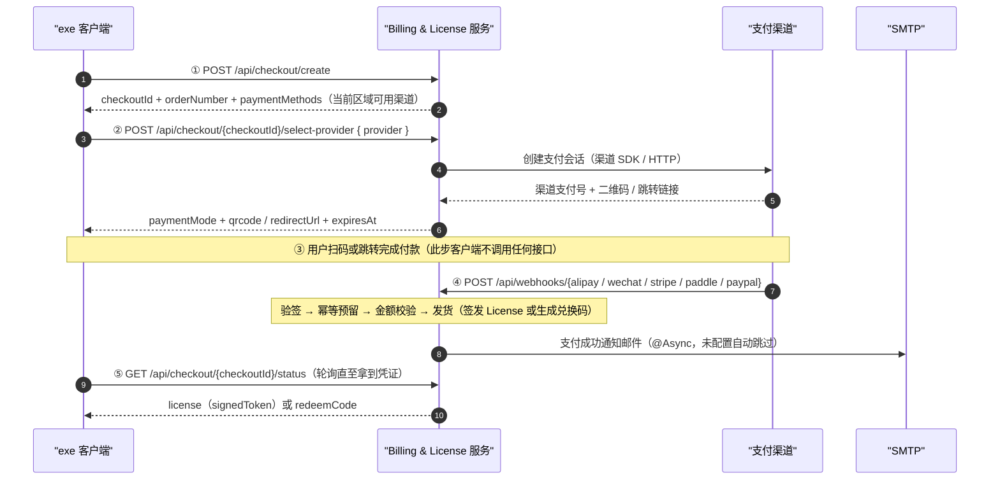
```mermaid
sequenceDiagram
    autonumber
    participant C as "exe 客户端"
    participant S as "Billing & License 服务"
    participant CH as "支付渠道"
    participant M as "SMTP"

    C->>S: ① POST /api/checkout/create
    S-->>C: checkoutId + orderNumber + paymentMethods（当前区域可用渠道）
    C->>S: ② POST /api/checkout/{checkoutId}/select-provider  { provider }
    S->>CH: 创建支付会话（渠道 SDK / HTTP）
    CH-->>S: 渠道支付号 + 二维码 / 跳转链接
    S-->>C: paymentMode + qrcode / redirectUrl + expiresAt
    Note over C,CH: ③ 用户扫码或跳转完成付款（此步客户端不调用任何接口）
    CH->>S: ④ POST /api/webhooks/{alipay / wechat / stripe / paddle / paypal}
    Note over S: 验签 → 幂等预留 → 金额校验 → 发货（签发 License 或生成兑换码）
    S->>M: 支付成功通知邮件（@Async，未配置自动跳过）
    C->>S: ⑤ GET /api/checkout/{checkoutId}/status（轮询直至拿到凭证）
    S-->>C: license（signedToken）或 redeemCode
```

**调用次序**：`① create` → `② select-provider` → `③ 用户付款（无接口调用）` → `④ Webhook（渠道服务端发起）` → `⑤ status 取凭证`

**一步下单捷径**：`① create` 的请求体带 `provider` 时，服务端在同一事务内顺带完成第 ② 步，首次响应即含二维码 / 跳转链接 —— 次序简化为 `① → ③ → ④ → ⑤`（详见 §3.2）。

**为何 ⑤ 不可省**：第 ④ 步由渠道发起，公网回调可能丢失或验签失败；`⑤ status` 在查不到渠道已支付时会**主动向渠道对账并补发货**（详见 §3.3）。因此轮询既是取凭证，也是兜底，客户端只需稳定轮询。

#### 1.7.2 客户端兑换与校验链路

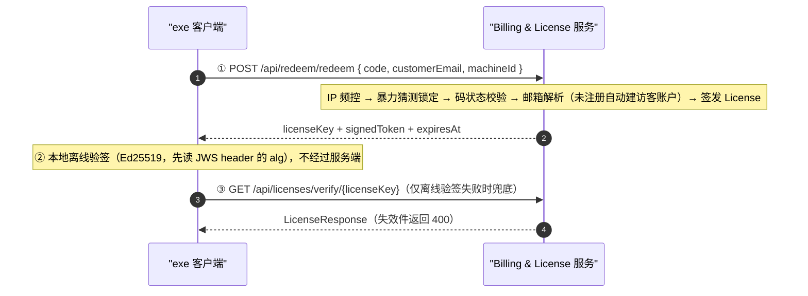
```mermaid
sequenceDiagram
    autonumber
    participant C as "exe 客户端"
    participant S as "Billing & License 服务"

    C->>S: ① POST /api/redeem/redeem  { code, customerEmail, machineId }
    Note over S: IP 频控 → 暴力猜测锁定 → 码状态校验 → 邮箱解析（未注册自动建访客账户）→ 签发 License
    S-->>C: licenseKey + signedToken + expiresAt
    Note over C: ② 本地离线验签（Ed25519，先读 JWS header 的 alg），不经过服务端
    C->>S: ③ GET /api/licenses/verify/{licenseKey}（仅离线验签失败时兜底）
    S-->>C: LicenseResponse（失效件返回 400）
```

**调用次序**：`① redeem` → `② 本地离线验签` →（仅失败时）`③ verify`

#### 1.7.3 客户端账号链路（v2.10 新增）

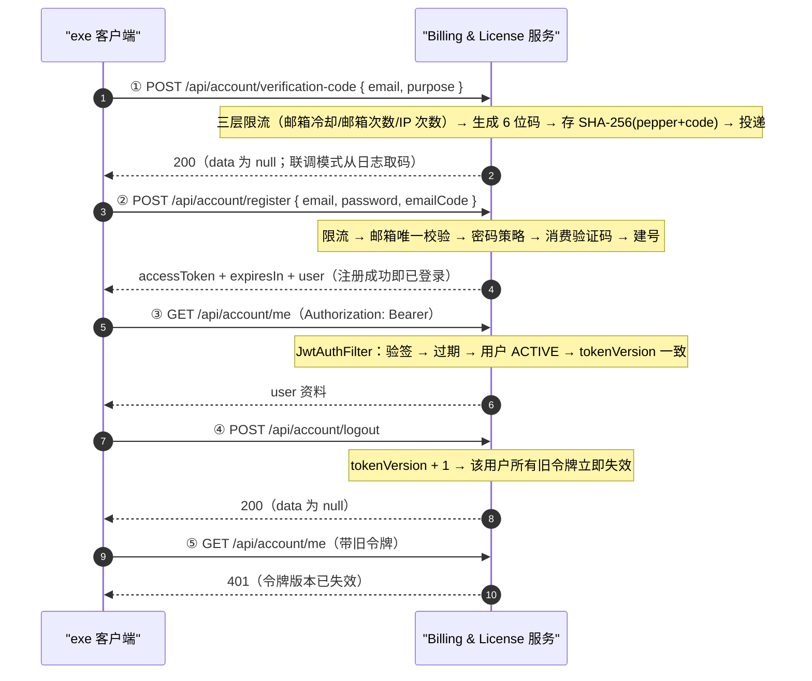
```mermaid
sequenceDiagram
    autonumber
    participant C as "exe 客户端"
    participant S as "Billing & License 服务"

    C->>S: ① POST /api/account/verification-code { email, purpose }
    Note over S: 三层限流（邮箱冷却/邮箱次数/IP 次数）→ 生成 6 位码 → 存 SHA-256(pepper+code) → 投递
    S-->>C: 200（data 为 null；联调模式从日志取码）
    C->>S: ② POST /api/account/register { email, password, emailCode }
    Note over S: 限流 → 邮箱唯一校验 → 密码策略 → 消费验证码 → 建号
    S-->>C: accessToken + expiresIn + user（注册成功即已登录）
    C->>S: ③ GET /api/account/me（Authorization: Bearer）
    Note over S: JwtAuthFilter：验签 → 过期 → 用户 ACTIVE → tokenVersion 一致
    S-->>C: user 资料
    C->>S: ④ POST /api/account/logout
    Note over S: tokenVersion + 1 → 该用户所有旧令牌立即失效
    S-->>C: 200（data 为 null）
    C->>S: ⑤ GET /api/account/me（带旧令牌）
    S-->>C: 401（令牌版本已失效）
```

**调用次序**：`① 发码` → `② 注册` → `③ me` → `④ 登出` → `⑤ me(401)`；已注册用户直接从 `POST /api/account/login` 进入 `③`。

**三个「必须知道」的约束**：

1. **发码与校验是两次请求**：验证码不在注册响应里返回；SMTP 未配置时服务端**静默跳过发送**，须开 `ACCOUNT_CODE_LOG_ONLY=true` 联调。
2. **登录失败锁定落库**：账号级计数在 `users.failed_login_count` / `locked_until`，跨重启有效；IP 级计数在内存（多实例部署会失效，与既有限制同源）。
3. **令牌失效靠 `tokenVersion`**：登出 / 改密 / 重置密码都只是 +1，`JwtAuthFilter` 每请求比对——因此「改密后旧设备仍在线」不会发生。

#### 1.7.4 管理端运维链路（全部需管理员 JWT：先以 `role=ADMIN` 的账号 `POST /api/account/login` 拿 `accessToken`，再带 `Authorization: Bearer <token>`）

| 场景 | 调用次序 | 关键说明 |
|---|---|---|
| 部署自检 | `GET /api/admin/payment-channels` | 先确认各渠道「配得对不对」，再跑真实交易；仅返回缺失配置项名，不回显密钥 |
| Webhook 丢失补发货 | `GET /api/admin/orders?orderNumber=` → `POST /api/admin/orders/{orderNumber}/issue` | 签发幂等，重复调用返回已签发记录（与自动发放同一服务方法） |
| 用户退款 | `GET /api/admin/orders?orderNumber=` → `POST /api/admin/orders/{orderNumber}/refund?reason=` | 渠道退款失败时落 `REFUND_FAILED`（保留 `PAID`）并抛异常，绝不谎报成功 |
| 售后换机 | `GET /api/admin/licenses?customerEmail=` → `POST /api/admin/licenses/{licenseKey}/reissue?newMachineId=` | 原证置 `REISSUED`，新证经 `reissuedFrom` 指回；受重发次数上限约束 |
| 违规作废 | `GET /api/admin/licenses/{licenseKey}` → `POST /api/admin/licenses/{licenseKey}/revoke?reason=` | 吊销唯一入口（客户端自吊销端点已删除） |
| 发卡给渠道方 | `POST /api/admin/redeem-codes/generate?productSku=&count=` → `GET /api/admin/redeem-codes?productSku=&status=` | 生成响应直接含码明文列表，便于导入发卡平台；事后可按产品/状态导出对账 |
| 兑换码作废 | `POST /api/admin/redeem-codes/revoke/{code}` | 已使用（`USED`）的码不可撤销 |

#### 1.7.5 用户端自助链路（U1/U2「我的授权」+ 自助退款）

| 场景 | 调用次序 | 关键说明 |
|---|---|---|
| 查看资产 | `GET /api/account/licenses` / `subscriptions` / `orders` | 仅本人资产；License 密钥**完整回显**（激活所需），离线验签 `signedToken` 不外发 |
| 退款入口显隐 | `GET /api/account/orders` | 服务端按 `RefundPolicy` 折算后回填 `refundable` / `refundableAmount`；**前端不做资格判断**，避免两处口径漂移 |
| 申请退款 | `POST /api/account/orders/{orderNumber}/refund` | 归属校验 → 限流 → 折算 → 复用 `AdminService.refundOrder(orderNumber, reason, 折算额)`；成功即吊销该订单全部 License |

**四条口径**（细节见 `README.md` §我的资产与自助退款）：

1. **越权按不存在返回**：非本人订单返回 `ORDER_NOT_FOUND`，不泄露他人订单存在性；越权请求不消耗限流配额。
2. **一单只退一次**：`paymentStatus ∈ {REFUNDED, PARTIALLY_REFUNDED}` 一律 `ALREADY_REFUNDED`。
3. **订阅订单不开放**：渠道侧无「取消订阅」调用能力，退款不取消订阅会持续扣款 → `NOT_REFUNDABLE` 引导人工。
4. **降级可追溯**：渠道不受理部分金额时自动改发全额退，并在订单 metadata 记 `refundDegraded`。

#### 1.7.6 凭证激活链路（plan-7.0 方案 A：单一入口）

> 此前客户端要认四条「绑定设备 + 拿签名令牌」的路径（购买直签 / 兑换码 / 在线校验 / 激活），
> 现收敛为**一个端点 + 一套返回**。该端点为**可选鉴权**（`JwtAuthFilter` 无令牌时不拦截，
> 仅跳过设置认证后放行），分支判定在服务端完成。

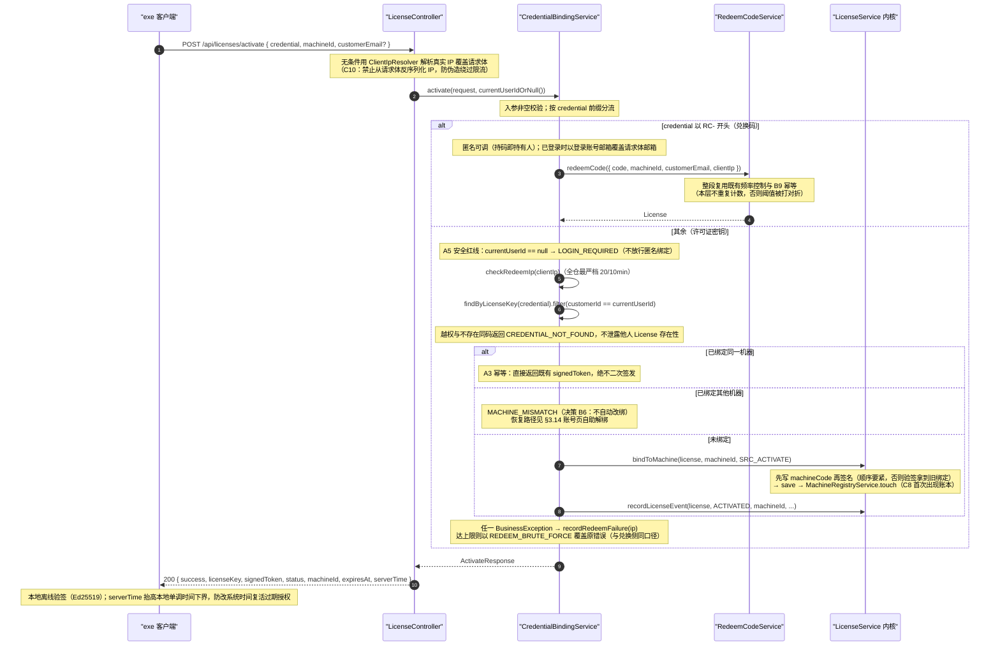
```mermaid
sequenceDiagram
    autonumber
    participant C as "exe 客户端"
    participant LC as "LicenseController"
    participant CBS as "CredentialBindingService"
    participant RCS as "RedeemCodeService"
    participant LS as "LicenseService 内核"

    C->>LC: POST /api/licenses/activate { credential, machineId, customerEmail? }
    Note over LC: 无条件用 ClientIpResolver 解析真实 IP 覆盖请求体<br/>（C10：禁止从请求体反序列化 IP，防伪造绕过限流）
    LC->>CBS: activate(request, currentUserIdOrNull())
    Note over CBS: 入参非空校验；按 credential 前缀分流

    alt credential 以 RC- 开头（兑换码）
        Note over CBS: 匿名可调（持码即持有人）；已登录时以登录账号邮箱覆盖请求体邮箱
        CBS->>RCS: redeemCode({ code, machineId, customerEmail, clientIp })
        Note over RCS: 整段复用既有频率控制与 B9 幂等<br/>（本层不重复计数，否则阈值被打对折）
        RCS-->>CBS: License
    else 其余（许可证密钥）
        Note over CBS: A5 安全红线：currentUserId == null → LOGIN_REQUIRED（不放行匿名绑定）
        CBS->>CBS: checkRedeemIp(clientIp)（全仓最严档 20/10min）
        CBS->>CBS: findByLicenseKey(credential).filter(customerId == currentUserId)
        Note over CBS: 越权与不存在同码返回 CREDENTIAL_NOT_FOUND，不泄露他人 License 存在性
        alt 已绑定同一机器
            Note over CBS: A3 幂等：直接返回既有 signedToken，绝不二次签发
        else 已绑定其他机器
            Note over CBS: MACHINE_MISMATCH（决策 B6：不自动改绑）<br/>恢复路径见 §3.14 账号页自助解绑
        else 未绑定
            CBS->>LS: bindToMachine(license, machineId, SRC_ACTIVATE)
            Note over LS: 先写 machineCode 再签名（顺序要紧，否则验签拿到旧绑定）<br/>→ save → MachineRegistryService.touch（C8 首次出现账本）
            CBS->>LS: recordLicenseEvent(license, ACTIVATED, machineId, ...)
        end
        Note over CBS: 任一 BusinessException → recordRedeemFailure(ip)<br/>达上限则以 REDEEM_BRUTE_FORCE 覆盖原错误（与兑换侧同口径）
    end

    CBS-->>LC: ActivateResponse
    LC-->>C: 200 { success, licenseKey, signedToken, status, machineId, expiresAt, serverTime }
    Note over C: 本地离线验签（Ed25519）；serverTime 抬高本地单调时间下界，防改系统时间复活过期授权
```

**调用次序**：`① activate（带 credential + machineId）` → `② 本地离线验签` →（仅失败时）`③ GET /api/licenses/verify/{licenseKey}`

**三条约束**：

1. **密钥分支改动不可放松**：账号页会明文展示 `licenseKey`，一旦置为匿名可绑，明文泄漏即等于「谁先抢到算谁的」——这是本设计不可松动的红线。
2. **兑换码分支不重写风控**：整段委托 `RedeemCodeService`，其内部已有 IP 频控 + 失败计数；本层再计一次会把阈值打对折。
3. **风控档位按最短板取严**：合并通道后密钥分支沿用兑换侧阈值（`redeemIpMax=20/10min`、`redeemFailureMax=10/10min`），因兑换码熵远低于许可证密钥、更易被暴力猜测。

---

## 二、横切机制时序

### 2.1 请求进入链：traceId → 鉴权 → 业务 → 响应壳

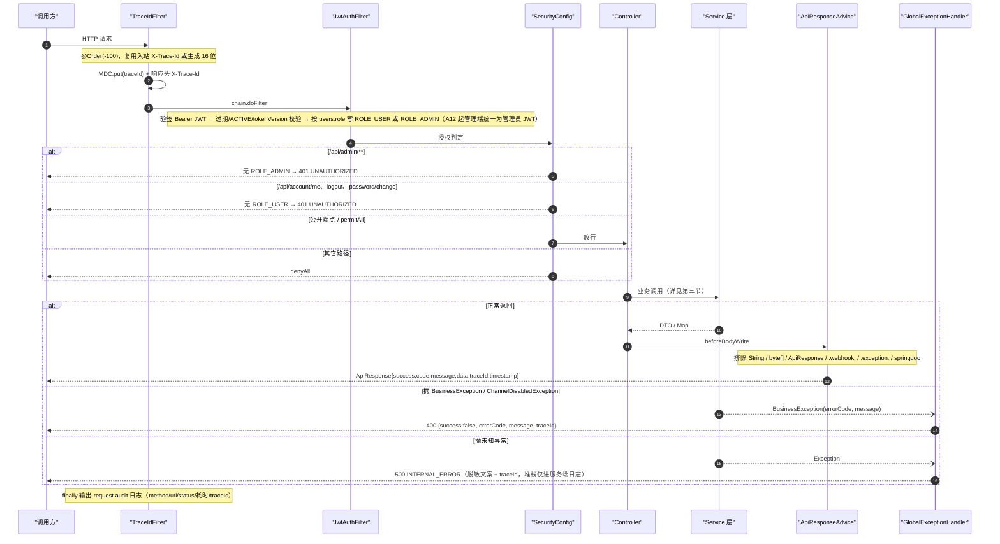
```mermaid
sequenceDiagram
    autonumber
    participant C as "调用方"
    participant TF as "TraceIdFilter"
    participant JF as "JwtAuthFilter"
    participant SC as "SecurityConfig"
    participant CT as "Controller"
    participant SV as "Service 层"
    participant ADV as "ApiResponseAdvice"
    participant GEH as "GlobalExceptionHandler"

    C->>TF: HTTP 请求
    Note over TF: @Order(-100)，复用入站 X-Trace-Id 或生成 16 位
    TF->>TF: MDC.put(traceId) + 响应头 X-Trace-Id
    TF->>JF: chain.doFilter
    Note over JF: 验签 Bearer JWT → 过期/ACTIVE/tokenVersion 校验 → 按 users.role 写 ROLE_USER 或 ROLE_ADMIN（A12 起管理端统一为管理员 JWT）
    JF->>SC: 授权判定
    alt /api/admin/**
        SC-->>C: 无 ROLE_ADMIN → 401 UNAUTHORIZED
    else /api/account/me、logout、password/change
        SC-->>C: 无 ROLE_USER → 401 UNAUTHORIZED
    else 公开端点 / permitAll
        SC->>CT: 放行
    else 其它路径
        SC-->>C: denyAll
    end
    CT->>SV: 业务调用（详见第三节）
    alt 正常返回
        SV-->>CT: DTO / Map
        CT->>ADV: beforeBodyWrite
        Note over ADV: 排除 String / byte[] / ApiResponse / .webhook. / .exception. / springdoc
        ADV-->>C: ApiResponse{success,code,message,data,traceId,timestamp}
    else 抛 BusinessException / ChannelDisabledException
        SV--)GEH: BusinessException(errorCode, message)
        GEH-->>C: 400 {success:false, errorCode, message, traceId}
    else 抛未知异常
        SV--)GEH: Exception
        GEH-->>C: 500 INTERNAL_ERROR（脱敏文案 + traceId，堆栈仅进服务端日志）
    end
    Note over TF: finally 输出 request audit 日志（method/uri/status/耗时/traceId）
```

**关注点**：
- traceId 存在**两套**：`TraceIdFilter` 写入 MDC 并回写响应头（正常路径）；`GlobalExceptionHandler#newTraceId()` **另生成**一个用于异常响应体。
  二者不一致 —— 异常响应体的 `traceId` 与响应头 `X-Trace-Id` 不同源，排查时以日志中的两个值交叉比对。
- `JwtAuthFilter` 只做认证不做授权；`/api/admin/**` 与需登录账号端点的 401 由 `SecurityConfig` 的 `HttpStatusEntryPoint` 产出。
- 启动期 fail-fast：鉴权无独立配置块（角色由 `users.role` 决定）；**`account.jwt-secret` 缺失或短于 32 字节则启动失败**（v2.10）；`payment.enabled-channels` 含无法识别渠道名则抛 `IllegalArgumentException`。
- 历史注记：`ApiKeyAuthFilter`（机读 `X-API-Key` 通道）与 `X-Admin-API-Key` 均已删除（A12 / 2026-09-23），管理端统一走管理员 JWT。

### 2.2 管理端审计切面（`@Audit` → `AuditAspect`）

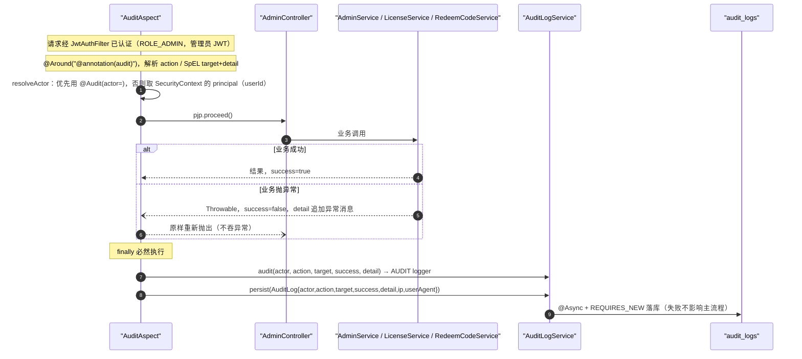
```mermaid
sequenceDiagram
    autonumber
    participant AA as "AuditAspect"
    participant CT as "AdminController"
    participant SV as "AdminService / LicenseService / RedeemCodeService"
    participant ALS as "AuditLogService"
    participant DB as "audit_logs"

    Note over AA: 请求经 JwtAuthFilter 已认证（ROLE_ADMIN，管理员 JWT）
    Note over AA: @Around("@annotation(audit)")，解析 action / SpEL target+detail
    AA->>AA: resolveActor：优先用 @Audit(actor=)，否则取 SecurityContext 的 principal（userId）
    AA->>CT: pjp.proceed()
    CT->>SV: 业务调用
    alt 业务成功
        SV-->>AA: 结果，success=true
    else 业务抛异常
        SV--)AA: Throwable，success=false，detail 追加异常消息
        AA--)CT: 原样重新抛出（不吞异常）
    end
    Note over AA: finally 必然执行
    AA->>ALS: audit(actor, action, target, success, detail) → AUDIT logger
    AA->>ALS: persist(AuditLog{actor,action,target,success,detail,ip,userAgent})
    ALS->>DB: @Async + REQUIRES_NEW 落库（失败不影响主流程）
```

---

## 三、业务时序图

> 本章按场景给出完整调用链，图中 `autonumber` 的序号即**调用次序**；端到端顺序总览见 §1.7，各接口的入参示例见第四章。

### 3.1 收银台 · 两步下单（create → select-provider）

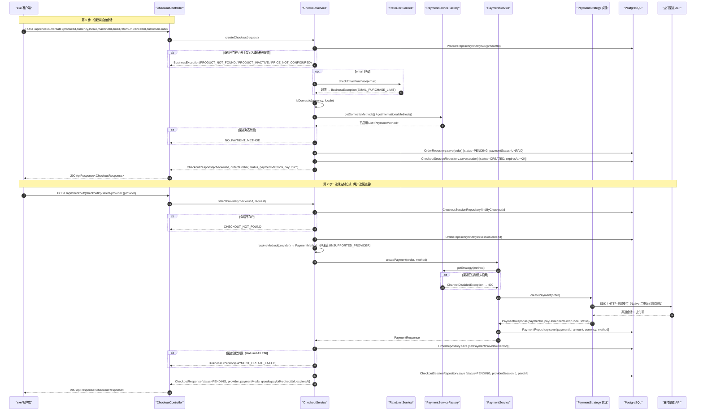
```mermaid
sequenceDiagram
    autonumber
    participant C as "exe 客户端"
    participant CT as "CheckoutController"
    participant CS as "CheckoutService"
    participant RL as "RateLimitService"
    participant PF as "PaymentServiceFactory"
    participant PS as "PaymentService"
    participant ST as "PaymentStrategy 实现"
    participant DB as "PostgreSQL"
    participant CH as "支付渠道 API"

    Note over C,CT: 第 1 步：创建收银台会话
    C->>CT: POST /api/checkout/create {productId,currency,locale,machineId,email,returnUrl,cancelUrl,customerEmail}
    CT->>CS: createCheckout(request)
    CS->>DB: ProductRepository.findBySku(productId)
    alt 商品不存在 / 未上架 / 区域价格未配置
        CS-->>CT: BusinessException(PRODUCT_NOT_FOUND / PRODUCT_INACTIVE / PRICE_NOT_CONFIGURED)
    end
    opt email 非空
        CS->>RL: checkEmailPurchase(email)
        RL-->>CS: 超限 → BusinessException(EMAIL_PURCHASE_LIMIT)
    end
    CS->>CS: isDomestic(currency, locale)
    CS->>PF: getDomesticMethods() / getInternationalMethods()
    PF-->>CS: 已启用 List<PaymentMethod>
    alt 渠道列表为空
        CS-->>CT: NO_PAYMENT_METHOD
    end
    CS->>DB: OrderRepository.save(order)  [status=PENDING, paymentStatus=UNPAID]
    CS->>DB: CheckoutSessionRepository.save(session)  [status=CREATED, expiresAt=+2h]
    CS-->>CT: CheckoutResponse{checkoutId, orderNumber, status, paymentMethods, payUrl=""}
    CT-->>C: 200 ApiResponse<CheckoutResponse>

    Note over C,CH: 第 2 步：选择支付方式（用户选渠道后）
    C->>CT: POST /api/checkout/{checkoutId}/select-provider {provider}
    CT->>CS: selectProvider(checkoutId, request)
    CS->>DB: CheckoutSessionRepository.findByCheckoutId
    alt 会话不存在
        CS-->>CT: CHECKOUT_NOT_FOUND
    end
    CS->>DB: OrderRepository.findById(session.orderId)
    CS->>CS: resolveMethod(provider) → PaymentMethod（非法值 UNSUPPORTED_PROVIDER）
    CS->>PS: createPayment(order, method)
    PS->>PF: getStrategy(method)
    alt 渠道已注册但未启用
        PF-->>PS: ChannelDisabledException → 400
    end
    PS->>ST: createPayment(order)
    ST->>CH: SDK / HTTP 创建支付（Native 二维码 / 跳转链接）
    CH-->>ST: 渠道会话 + 支付号
    ST-->>PS: PaymentResponse{paymentId, payUrl/redirectUrl/qrCode, status}
    PS->>DB: PaymentRepository.save  [paymentId, amount, currency, method]
    PS-->>CS: PaymentResponse
    CS->>DB: OrderRepository.save  [setPaymentProvider(method)]
    alt 渠道创建失败（status=FAILED）
        CS-->>CT: BusinessException(PAYMENT_CREATE_FAILED)
    end
    CS->>DB: CheckoutSessionRepository.save [status=PENDING, providerSessionId, payUrl]
    CS-->>CT: CheckoutResponse{status=PENDING, provider, paymentMode, qrcode/payUrl/redirectUrl, expiresAt}
    CT-->>C: 200 ApiResponse<CheckoutResponse>
```

### 3.2 收银台 · 一步下单（create 携带 provider）

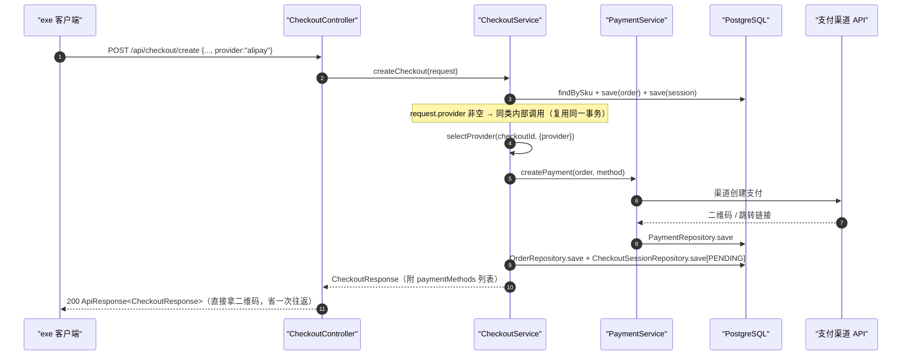
```mermaid
sequenceDiagram
    autonumber
    participant C as "exe 客户端"
    participant CT as "CheckoutController"
    participant CS as "CheckoutService"
    participant PS as "PaymentService"
    participant DB as "PostgreSQL"
    participant CH as "支付渠道 API"

    C->>CT: POST /api/checkout/create {..., provider:"alipay"}
    CT->>CS: createCheckout(request)
    CS->>DB: findBySku + save(order) + save(session)
    Note over CS: request.provider 非空 → 同类内部调用（复用同一事务）
    CS->>CS: selectProvider(checkoutId, {provider})
    CS->>PS: createPayment(order, method)
    PS->>CH: 渠道创建支付
    CH-->>PS: 二维码 / 跳转链接
    PS->>DB: PaymentRepository.save
    CS->>DB: OrderRepository.save + CheckoutSessionRepository.save[PENDING]
    CS-->>CT: CheckoutResponse（附 paymentMethods 列表）
    CT-->>C: 200 ApiResponse<CheckoutResponse>（直接拿二维码，省一次往返）
```

### 3.3 支付状态轮询 + 主动对账补偿（Webhook 丢失兜底）

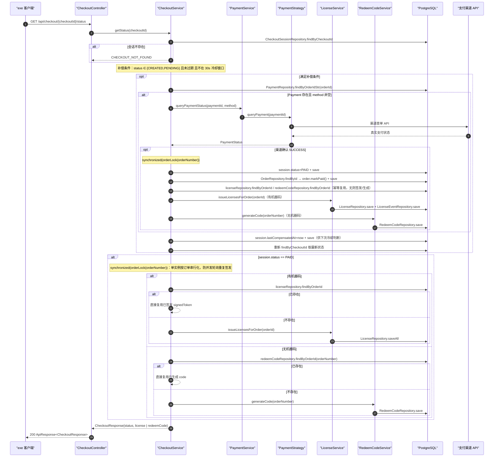
```mermaid
sequenceDiagram
    autonumber
    participant C as "exe 客户端"
    participant CT as "CheckoutController"
    participant CS as "CheckoutService"
    participant PS as "PaymentService"
    participant ST as "PaymentStrategy"
    participant LR as "LicenseService"
    participant RC as "RedeemCodeService"
    participant DB as "PostgreSQL"
    participant CH as "支付渠道 API"

    C->>CT: GET /api/checkout/{checkoutId}/status
    CT->>CS: getStatus(checkoutId)
    CS->>DB: CheckoutSessionRepository.findByCheckoutId
    alt 会话不存在
        CS-->>CT: CHECKOUT_NOT_FOUND
    end

    Note over CS: 补偿条件：status ∈ {CREATED,PENDING} 且未过期 且不在 30s 冷却窗口
    opt 满足补偿条件
        CS->>DB: PaymentRepository.findByOrderIdStr(orderId)
        alt Payment 存在且 method 非空
            CS->>PS: queryPaymentStatus(paymentId, method)
            PS->>ST: queryPayment(paymentId)
            ST->>CH: 渠道查单 API
            CH-->>ST: 真实支付状态
            ST-->>CS: PaymentStatus
            opt 渠道确认 SUCCESS
                Note over CS: synchronized(orderLock(orderNumber))
                CS->>DB: session.status=PAID + save
                CS->>DB: OrderRepository.findById → order.markPaid() + save
                CS->>DB: licenseRepository.findByOrderId / redeemCodeRepository.findByOrderId（幂等复用，无则签发/生成）
                CS->>LR: issueLicensesForOrder(orderId)（有机器码）
                LR->>DB: LicenseRepository.save + LicenseEventRepository.save
                CS->>RC: generateCode(orderNumber)（无机器码）
                RC->>DB: RedeemCodeRepository.save
            end
        end
        CS->>DB: session.lastCompensatedAt=now + save（供下次冷却判断）
        CS->>DB: 重新 findByCheckoutId 取最新状态
    end

    alt session.status == PAID
        Note over CS: synchronized(orderLock(orderNumber))：单实例按订单串行化，防并发轮询重复签发
        alt 有机器码
            CS->>DB: licenseRepository.findByOrderId
            alt 已存在
                CS-->>CS: 直接复用已签发 signedToken
            else 不存在
                CS->>LR: issueLicensesForOrder(orderId)
                LR->>DB: LicenseRepository.saveAll
            end
        else 无机器码
            CS->>DB: redeemCodeRepository.findByOrderId(orderNumber)
            alt 已存在
                CS-->>CS: 直接复用已生成 code
            else 不存在
                CS->>RC: generateCode(orderNumber)
                RC->>DB: RedeemCodeRepository.save
            end
        end
    end
    CS-->>CT: CheckoutResponse{status, license | redeemCode}
    CT-->>C: 200 ApiResponse<CheckoutResponse>
```

> 补偿失败（渠道超时/异常）被 `catch` 吞掉仅记 warn，不影响轮询返回，等待 Webhook 或下次轮询重试。
> 多实例部署时进程内锁不足，需补分布式锁（代码注释已声明）。

### 3.4 Webhook 支付回调 → 发货（主链路）

#### 3.4.1 渠道入口差异

| 端点 | 验签材料来源 |
|---|---|
| `POST /api/webhooks/alipay` | form-urlencoded body 中的 `sign`（`FormParamParser.parse`），**不在 Header** |
| `POST /api/webhooks/wechat` | Header `Wechatpay-Signature`（配合 Timestamp/Nonce/Serial）；成功才返回 `{"code":"SUCCESS","message":"OK"}` |
| `POST /api/webhooks/stripe` | Header `Stripe-Signature` |
| `POST /api/webhooks/paddle` | Header `Paddle-Signature` |
| `POST /api/webhooks/paypal` | Header `Paypal-Transmission-Id` |

#### 3.4.2 统一处理时序

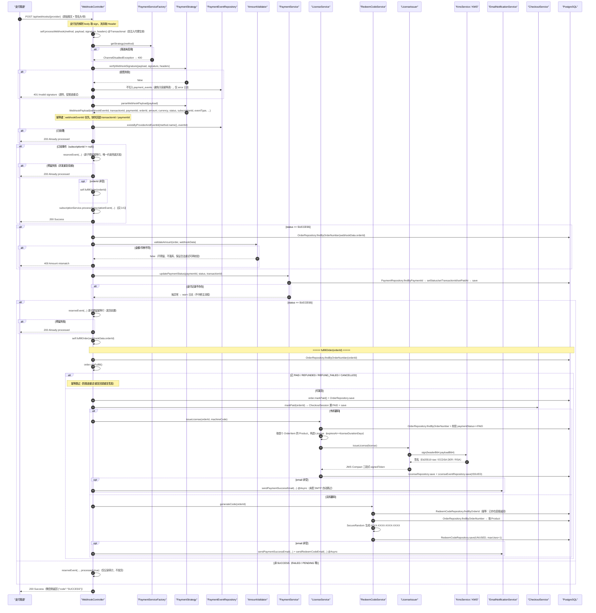
```mermaid
sequenceDiagram
    autonumber
    participant CH as "支付渠道"
    participant WC as "WebhookController"
    participant PF as "PaymentServiceFactory"
    participant ST as "PaymentStrategy"
    participant PE as "PaymentEventRepository"
    participant AV as "AmountValidator"
    participant PS as "PaymentService"
    participant LR as "LicenseService"
    participant RC as "RedeemCodeService"
    participant LI as "LicenseIssuer"
    participant KMS as "KmsService / KMS"
    participant MAIL as "EmailNotificationService"
    participant CS as "CheckoutService"
    participant DB as "PostgreSQL"

    CH->>WC: POST /api/webhooks/{provider}（原始报文 + 签名头/体）
    Note over WC: 支付宝先解析 body 取 sign，其余取 Header
    WC->>WC: self.processWebhook(method, payload, signature, headers)  @Transactional（自注入代理生效）
    WC->>PF: getStrategy(method)
    alt 渠道未启用
        PF-->>WC: ChannelDisabledException → 400
    end
    WC->>ST: verifyWebhookSignature(payload, signature, headers)
    alt 验签失败
        ST-->>WC: false
        WC->>PE: 不写入 payment_events（避免污染幂等表），仅 error 日志
        WC-->>CH: 401 Invalid signature（透传，促渠道重试）
    end
    WC->>ST: parseWebhookPayload(payload)
    ST-->>WC: WebhookPayload{webhookEventId, transactionId, paymentId, orderId, amount, currency, status, subscriptionId, eventType, ...}

    Note over WC: 幂等键：webhookEventId 优先，缺失回退 transactionId / paymentId
    WC->>PE: existsByProviderAndEventId(method.name(), eventId)
    alt 已处理
        WC-->>CH: 200 Already processed
    end

    alt 订阅事件（subscriptionId != null）
        WC->>WC: reserveEvent(...)（原子预留幂等行，唯一约束兜底并发）
        alt 预留失败（并发重复投递）
            WC-->>CH: 200 Already processed
        end
        opt orderId 非空
            WC->>WC: self.fulfillOrder(orderId)
        end
        WC->>WC: subscriptionService.processSubscriptionEvent(...)  【见 3.5】
        WC-->>CH: 200 Success
    end

    alt status == SUCCESS
        WC->>DB: OrderRepository.findByOrderNumber(webhookData.orderId)
        WC->>AV: validateAmount(order, webhookData)
        alt 金额/币种不符
            AV-->>WC: false（不预留、不落库，保证合法重试可再校验）
            WC-->>CH: 400 Amount mismatch
        end
    end

    WC->>PS: updatePaymentStatus(paymentId, status, transactionId)
    PS->>DB: PaymentRepository.findByPaymentId → setStatus/setTransactionId/setPaidAt → save
    alt 支付记录不存在
        PS-->>WC: 抛异常 → warn 日志（不中断主流程）
    end

    alt status == SUCCESS
        WC->>WC: reserveEvent(...) 原子预留幂等行（发货前置）
        alt 预留失败
            WC-->>CH: 200 Already processed
        end
        WC->>WC: self.fulfillOrder(webhookData.orderId)

        Note over WC,DB: ===== fulfillOrder(orderId) =====
        WC->>DB: OrderRepository.findByOrderNumber(orderId)
        WC->>WC: order.canFulfill()
        alt 已 PAID / REFUNDED / REFUND_FAILED / CANCELLED
            Note over WC: 幂等跳过（防渠道重试/重复回调重复签发）
        else 可发货
            WC->>DB: order.markPaid() + OrderRepository.save
            WC->>CS: markPaid(orderId) → CheckoutSession 置 PAID + save
            alt 有机器码
                WC->>LR: issueLicense(orderId, machineCode)
                LR->>DB: OrderRepository.findByOrderNumber + 校验 paymentStatus==PAID
                LR->>LR: 取首个 OrderItem 的 Product，构造 License（expiresAt=+licenseDurationDays）
                LR->>LI: issueLicense(license)
                LI->>KMS: sign(headerB64.payloadB64)
                KMS-->>LI: 签名（Ed25519 raw / ECDSA DER / RSA）
                LI-->>LR: JWS Compact 三段式 signedToken
                LR->>DB: LicenseRepository.save + LicenseEventRepository.save(ISSUED)
                opt email 非空
                    WC->>MAIL: sendPaymentSuccessEmail(...)  @Async（未配 SMTP 自动跳过）
                end
            else 无机器码
                WC->>RC: generateCode(orderId)
                RC->>DB: RedeemCodeRepository.findByOrderId（幂等：已存在直接返回）
                RC->>DB: OrderRepository.findByOrderNumber → 取 Product
                RC->>RC: SecureRandom 生成 XXXX-XXXX-XXXX-XXXX
                RC->>DB: RedeemCodeRepository.save(UNUSED, maxUses=1)
                opt email 非空
                    WC->>MAIL: sendPaymentSuccessEmail(...) + sendRedeemCodeEmail(...)  @Async
                end
            end
        end
    else 非 SUCCESS（FAILED / PENDING 等）
        WC->>WC: reserveEvent(..., processed=true)（仅记录审计，不发货）
    end
    WC-->>CH: 200 Success（微信侧返回 {"code":"SUCCESS"}）
```

### 3.5 订阅事件处理（首充 / 续费 / 取消）

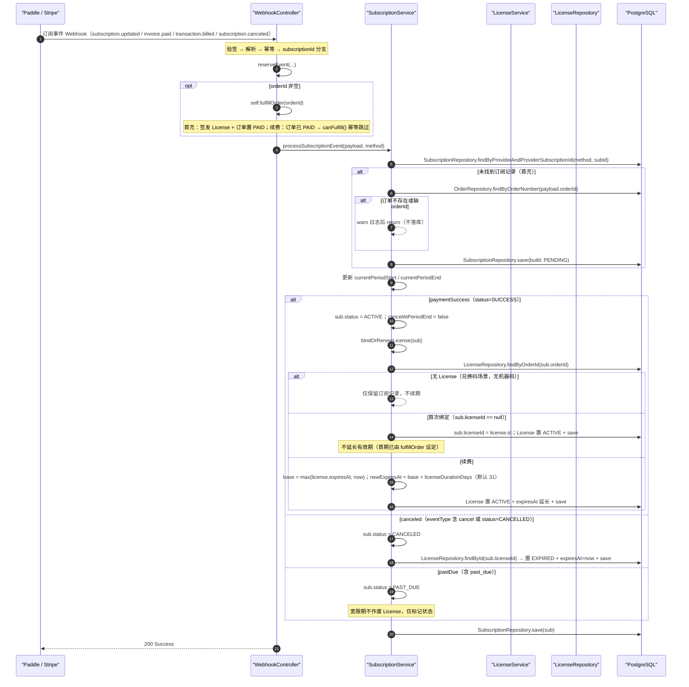
```mermaid
sequenceDiagram
    autonumber
    participant CH as "Paddle / Stripe"
    participant WC as "WebhookController"
    participant SS as "SubscriptionService"
    participant LR as "LicenseService"
    participant LSR as "LicenseRepository"
    participant DB as "PostgreSQL"

    CH->>WC: 订阅事件 Webhook（subscription.updated / invoice.paid / transaction.billed / subscription.canceled）
    Note over WC: 验签 → 解析 → 幂等 → subscriptionId 分支
    WC->>WC: reserveEvent(...)
    opt orderId 非空
        WC->>WC: self.fulfillOrder(orderId)
        Note over WC: 首充：签发 License + 订单置 PAID；续费：订单已 PAID → canFulfill() 幂等跳过
    end
    WC->>SS: processSubscriptionEvent(payload, method)
    SS->>DB: SubscriptionRepository.findByProviderAndProviderSubscriptionId(method, subId)
    alt 未找到订阅记录（首充）
        SS->>DB: OrderRepository.findByOrderNumber(payload.orderId)
        alt 订单不存在或缺 orderId
            SS-->>SS: warn 日志后 return（不落库）
        end
        SS->>DB: SubscriptionRepository.save(build: PENDING)
    end
    SS->>SS: 更新 currentPeriodStart / currentPeriodEnd
    alt paymentSuccess（status=SUCCESS）
        SS->>SS: sub.status = ACTIVE；cancelAtPeriodEnd = false
        SS->>SS: bindOrRenewLicense(sub)
        SS->>DB: LicenseRepository.findByOrderId(sub.orderId)
        alt 无 License（兑换码场景，无机器码）
            SS-->>SS: 仅保留订阅记录，不续期
        else 首次绑定（sub.licenseId == null）
            SS->>DB: sub.licenseId = license.id；License 置 ACTIVE + save
            Note over SS: 不延长有效期（首期已由 fulfillOrder 设定）
        else 续费
            SS->>SS: base = max(license.expiresAt, now)；newExpiresAt = base + licenseDurationDays（默认 31）
            SS->>DB: License 置 ACTIVE + expiresAt 延长 + save
        end
    else canceled（eventType 含 cancel 或 status=CANCELLED）
        SS->>SS: sub.status = CANCELED
        SS->>DB: LicenseRepository.findById(sub.licenseId) → 置 EXPIRED + expiresAt=now + save
    else pastDue（含 past_due）
        SS->>SS: sub.status = PAST_DUE
        Note over SS: 宽限期不作废 License，仅标记状态
    end
    SS->>DB: SubscriptionRepository.save(sub)
    WC-->>CH: 200 Success
```

### 3.6 兑换码兑换 License

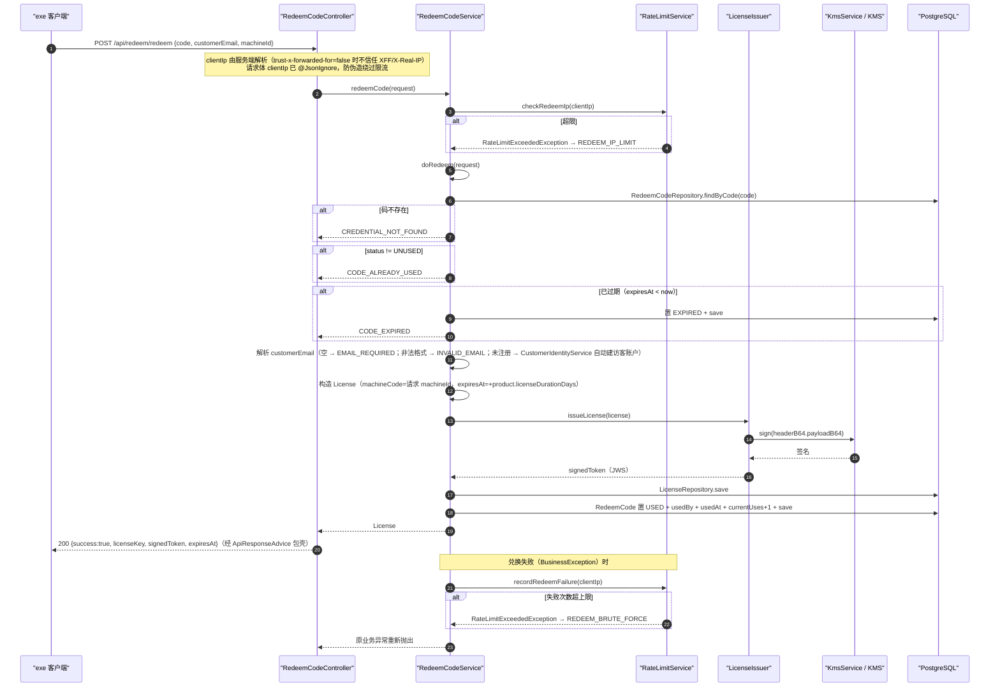
```mermaid
sequenceDiagram
    autonumber
    participant C as "exe 客户端"
    participant RC as "RedeemCodeController"
    participant RS as "RedeemCodeService"
    participant RL as "RateLimitService"
    participant LI as "LicenseIssuer"
    participant KMS as "KmsService / KMS"
    participant DB as "PostgreSQL"

    C->>RC: POST /api/redeem/redeem {code, customerEmail, machineId}
    Note over RC: clientIp 由服务端解析（trust-x-forwarded-for=false 时不信任 XFF/X-Real-IP）<br/>请求体 clientIp 已 @JsonIgnore，防伪造绕过限流
    RC->>RS: redeemCode(request)
    RS->>RL: checkRedeemIp(clientIp)
    alt 超限
        RL-->>RS: RateLimitExceededException → REDEEM_IP_LIMIT
    end
    RS->>RS: doRedeem(request)
    RS->>DB: RedeemCodeRepository.findByCode(code)
    alt 码不存在
        RS-->>RC: CREDENTIAL_NOT_FOUND
    end
    alt status != UNUSED
        RS-->>RC: CODE_ALREADY_USED
    end
    alt 已过期（expiresAt < now）
        RS->>DB: 置 EXPIRED + save
        RS-->>RC: CODE_EXPIRED
    end
    RS->>RS: 解析 customerEmail（空 → EMAIL_REQUIRED；非法格式 → INVALID_EMAIL；未注册 → CustomerIdentityService 自动建访客账户）
    RS->>RS: 构造 License（machineCode=请求 machineId，expiresAt=+product.licenseDurationDays）
    RS->>LI: issueLicense(license)
    LI->>KMS: sign(headerB64.payloadB64)
    KMS-->>LI: 签名
    LI-->>RS: signedToken（JWS）
    RS->>DB: LicenseRepository.save
    RS->>DB: RedeemCode 置 USED + usedBy + usedAt + currentUses+1 + save
    RS-->>RC: License
    RC-->>C: 200 {success:true, licenseKey, signedToken, expiresAt}（经 ApiResponseAdvice 包壳）

    Note over RS,RL: 兑换失败（BusinessException）时
    RS->>RL: recordRedeemFailure(clientIp)
    alt 失败次数超上限
        RL-->>RS: RateLimitExceededException → REDEEM_BRUTE_FORCE
    end
    RS-->>RC: 原业务异常重新抛出
```

### 3.7 License 在线校验（verify）

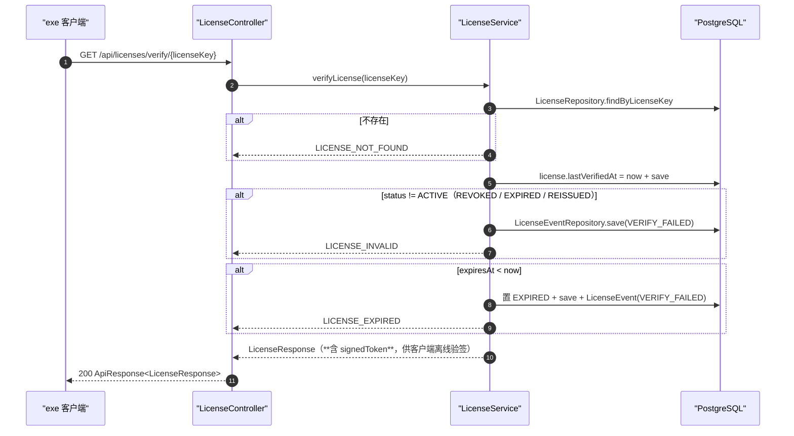
```mermaid
sequenceDiagram
    autonumber
    participant C as "exe 客户端"
    participant LC as "LicenseController"
    participant LS as "LicenseService"
    participant DB as "PostgreSQL"

    C->>LC: GET /api/licenses/verify/{licenseKey}
    LC->>LS: verifyLicense(licenseKey)
    LS->>DB: LicenseRepository.findByLicenseKey
    alt 不存在
        LS-->>LC: LICENSE_NOT_FOUND
    end
    LS->>DB: license.lastVerifiedAt = now + save
    alt status != ACTIVE（REVOKED / EXPIRED / REISSUED）
        LS->>DB: LicenseEventRepository.save(VERIFY_FAILED)
        LS-->>LC: LICENSE_INVALID
    end
    alt expiresAt < now
        LS->>DB: 置 EXPIRED + save + LicenseEvent(VERIFY_FAILED)
        LS-->>LC: LICENSE_EXPIRED
    end
    LS-->>LC: LicenseResponse（**含 signedToken**，供客户端离线验签）
    LC-->>C: 200 ApiResponse<LicenseResponse>
```

> 与 `GET /api/admin/licenses/{licenseKey}` 的区别：verify 对失效件返回 400；管理端接口**不过滤状态**且以 `adminView` 屏蔽 `signedToken`。

### 3.8 管理端 · 订单查询与补签发

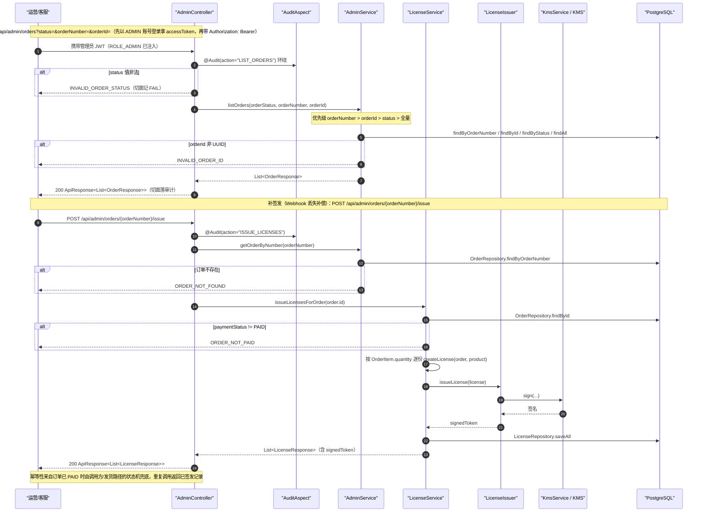
```mermaid
sequenceDiagram
    autonumber
    participant OP as "运营/客服"
    participant AC as "AdminController"
    participant AA as "AuditAspect"
    participant AS as "AdminService"
    participant LS as "LicenseService"
    participant LI as "LicenseIssuer"
    participant KMS as "KmsService / KMS"
    participant DB as "PostgreSQL"

    Note over OP,AC: 查询：GET /api/admin/orders?status=&orderNumber=&orderId=（先以 ADMIN 账号登录拿 accessToken，再带 Authorization: Bearer）
    OP->>AC: 携带管理员 JWT（ROLE_ADMIN 已注入）
    AC->>AA: @Audit(action="LIST_ORDERS") 环绕
    alt status 值非法
        AC-->>OP: INVALID_ORDER_STATUS（切面记 FAIL）
    end
    AC->>AS: listOrders(orderStatus, orderNumber, orderId)
    Note over AS: 优先级 orderNumber > orderId > status > 全量
    AS->>DB: findByOrderNumber / findById / findByStatus / findAll
    alt orderId 非 UUID
        AS-->>OP: INVALID_ORDER_ID
    end
    AS-->>AC: List<OrderResponse>
    AC-->>OP: 200 ApiResponse<List<OrderResponse>>（切面落审计）

    Note over OP,DB: 补签发（Webhook 丢失补偿）：POST /api/admin/orders/{orderNumber}/issue
    OP->>AC: POST /api/admin/orders/{orderNumber}/issue
    AC->>AA: @Audit(action="ISSUE_LICENSES")
    AC->>AS: getOrderByNumber(orderNumber)
    AS->>DB: OrderRepository.findByOrderNumber
    alt 订单不存在
        AS-->>OP: ORDER_NOT_FOUND
    end
    AC->>LS: issueLicensesForOrder(order.id)
    LS->>DB: OrderRepository.findById
    alt paymentStatus != PAID
        LS-->>OP: ORDER_NOT_PAID
    end
    LS->>LS: 按 OrderItem.quantity 逐份 createLicense(order, product)
    LS->>LI: issueLicense(license)
    LI->>KMS: sign(...)
    KMS-->>LI: 签名
    LI-->>LS: signedToken
    LS->>DB: LicenseRepository.saveAll
    LS-->>AC: List<LicenseResponse>（含 signedToken）
    AC-->>OP: 200 ApiResponse<List<LicenseResponse>>
    Note over OP,AC: 幂等性来自订单已 PAID 时由调用方/发货路径的状态机兜底，重复调用返回已签发记录
```

### 3.9 管理端 · 退款（渠道失败绝不谎报成功）

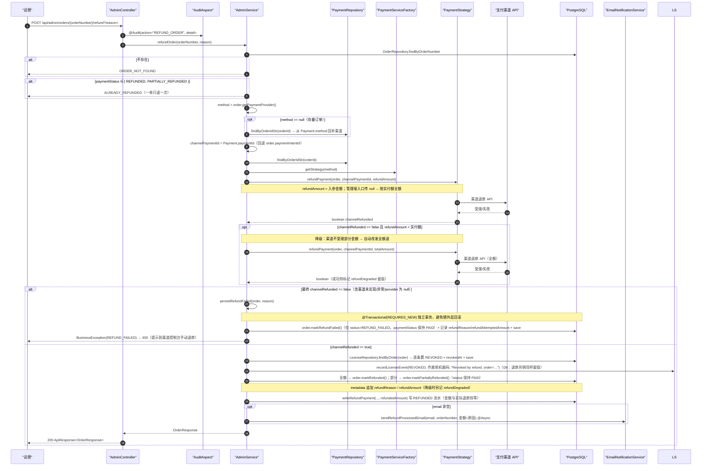
```mermaid
sequenceDiagram
    autonumber
    participant OP as "运营"
    participant AC as "AdminController"
    participant AA as "AuditAspect"
    participant AS as "AdminService"
    participant PR as "PaymentRepository"
    participant PF as "PaymentServiceFactory"
    participant ST as "PaymentStrategy"
    participant CH as "支付渠道 API"
    participant DB as "PostgreSQL"
    participant MAIL as "EmailNotificationService"

    OP->>AC: POST /api/admin/orders/{orderNumber}/refund?reason=
    AC->>AA: @Audit(action="REFUND_ORDER", detail=#reason)
    AC->>AS: refundOrder(orderNumber, reason)
    AS->>DB: OrderRepository.findByOrderNumber
    alt 不存在
        AS-->>OP: ORDER_NOT_FOUND
    end
    alt paymentStatus ∈ { REFUNDED, PARTIALLY_REFUNDED }
        AS-->>OP: ALREADY_REFUNDED（一单只退一次）
    end

    AS->>AS: method = order.getPaymentProvider()
    opt method == null（存量订单）
        AS->>PR: findByOrderIdStr(orderId) → 从 Payment.method 回补渠道
    end
    AS->>AS: channelPaymentId = Payment.paymentId（回退 order.paymentIntentId）
    AS->>PR: findByOrderIdStr(orderId)

    AS->>PF: getStrategy(method)
    AS->>ST: refundPayment(order, channelPaymentId, refundAmount)
    Note over AS,ST: refundAmount = 入参金额；管理端入口传 null → 按实付额全额
    ST->>CH: 渠道退款 API
    CH-->>ST: 受理/失败
    ST-->>AS: boolean channelRefunded

    opt channelRefunded == false 且 refundAmount < 实付额
        Note over AS,ST: 降级：渠道不受理部分金额 → 自动改发全额退
        AS->>ST: refundPayment(order, channelPaymentId, totalAmount)
        ST->>CH: 渠道退款 API（全额）
        CH-->>ST: 受理/失败
        ST-->>AS: boolean（成功则标记 refundDegraded 留痕）
    end

    alt 最终 channelRefunded == false（含渠道未实现/异常/provider 为 null）
        AS->>AS: persistRefundFailed(order, reason)
        Note over AS,DB: @Transactional(REQUIRES_NEW) 独立事务，避免随外层回滚
        AS->>DB: order.markRefundFailed()（仅 status=REFUND_FAILED，paymentStatus 保持 PAID）+ 记录 refundReason/refundAttemptedAmount + save
        AS-->>OP: BusinessException(REFUND_FAILED) → 400（提示到渠道控制台手动退款）
    else channelRefunded == true
        AS->>DB: LicenseRepository.findByOrder(order) → 逐条置 REVOKED + revokedAt + save
        AS->>LS: recordLicenseEvent(REVOKED, 作废前机器码, "Revoked by refund. order=…")（D6：退款吊销同样留痕）
        AS->>DB: 全额 → order.markRefunded()；部分 → order.markPartiallyRefunded()（status 保持 PAID）
        Note over AS,DB: metadata 追加 refundReason / refundAmount（降级时另记 refundDegraded）
        AS->>DB: writeRefundPayment(..., refundedAmount) 写 REFUNDED 流水（金额与实际退款恒等）
        opt email 非空
            AS->>MAIL: sendRefundProcessedEmail(email, orderNumber, 金额+原因)  @Async
        end
        AS-->>AC: OrderResponse
        AC-->>OP: 200 ApiResponse<OrderResponse>
    end
```

> `appendMetadata` 用 `ObjectMapper` 构造 JSON（避免手写拼接的转义/注入），脏数据以 `raw` 字段兜底，序列化失败再退化为手写拼接。

### 3.10 管理端 · License 查询 / 作废 / 换机重发

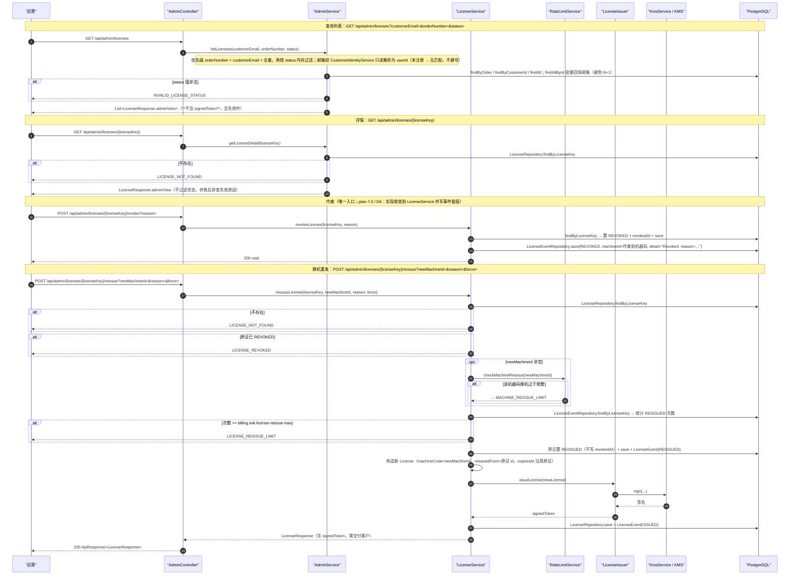
```mermaid
sequenceDiagram
    autonumber
    participant OP as "运营"
    participant AC as "AdminController"
    participant AS as "AdminService"
    participant LS as "LicenseService"
    participant RL as "RateLimitService"
    participant LI as "LicenseIssuer"
    participant KMS as "KmsService / KMS"
    participant DB as "PostgreSQL"

    Note over OP,DB: 查询列表：GET /api/admin/licenses?customerEmail=&orderNumber=&status=
    OP->>AC: GET /api/admin/licenses
    AC->>AS: listLicenses(customerEmail, orderNumber, status)
    Note over AS: 优先级 orderNumber > customerEmail > 全量，再按 status 内存过滤；邮箱经 CustomerIdentityService 只读解析为 userId（未注册 → 无匹配，不建号）
    AS->>DB: findByOrder / findByCustomerId / findAll；findAllById 批量回填邮箱（避免 N+1）
    alt status 值非法
        AS-->>OP: INVALID_LICENSE_STATUS
    end
    AS-->>OP: List<LicenseResponse.adminView>（**不含 signedToken**，含失效件）

    Note over OP,DB: 详情：GET /api/admin/licenses/{licenseKey}
    OP->>AC: GET /api/admin/licenses/{licenseKey}
    AC->>AS: getLicenseDetail(licenseKey)
    AS->>DB: LicenseRepository.findByLicenseKey
    alt 不存在
        AS-->>OP: LICENSE_NOT_FOUND
    end
    AS-->>OP: LicenseResponse.adminView（不过滤状态，供售后排查失效原因）

    Note over OP,DB: 作废（唯一入口；plan-7.0 / D6：实现收敛到 LicenseService 并写事件留痕）
    OP->>AC: POST /api/admin/licenses/{licenseKey}/revoke?reason=
    AC->>LS: revokeLicense(licenseKey, reason)
    LS->>DB: findByLicenseKey → 置 REVOKED + revokedAt + save
    LS->>DB: LicenseEventRepository.save(REVOKED, machineId=作废前机器码, detail="Revoked. reason=…")
    LS-->>OP: 200 void

    Note over OP,DB: 换机重发：POST /api/admin/licenses/{licenseKey}/reissue?newMachineId=&reason=&force=
    OP->>AC: POST /api/admin/licenses/{licenseKey}/reissue?newMachineId=&reason=&force=
    AC->>LS: reissueLicense(licenseKey, newMachineId, reason, force)
    LS->>DB: LicenseRepository.findByLicenseKey
    alt 不存在
        LS-->>OP: LICENSE_NOT_FOUND
    end
    alt 原证已 REVOKED
        LS-->>OP: LICENSE_REVOKED
    end
    opt newMachineId 非空
        LS->>RL: checkMachineReissue(newMachineId)
        alt 该机器码换机过于频繁
            RL-->>LS: → MACHINE_REISSUE_LIMIT
        end
    end
    LS->>DB: LicenseEventRepository.findByLicenseKey → 统计 REISSUED 次数
    alt 次数 >= billing.risk.license-reissue-max
        LS-->>OP: LICENSE_REISSUE_LIMIT
    end
    LS->>DB: 原证置 REISSUED（不写 revokedAt）+ save + LicenseEvent(REISSUED)
    LS->>LS: 构造新 License（machineCode=newMachineId，reissuedFrom=原证 id，expiresAt 沿用原证）
    LS->>LI: issueLicense(newLicense)
    LI->>KMS: sign(...)
    KMS-->>LI: 签名
    LI-->>LS: signedToken
    LS->>DB: LicenseRepository.save + LicenseEvent(ISSUED)
    LS-->>AC: LicenseResponse（含 signedToken，需交付客户）
    AC-->>OP: 200 ApiResponse<LicenseResponse>
```

### 3.11 管理端 · 兑换码生成 / 导出 / 撤销 + 渠道自查

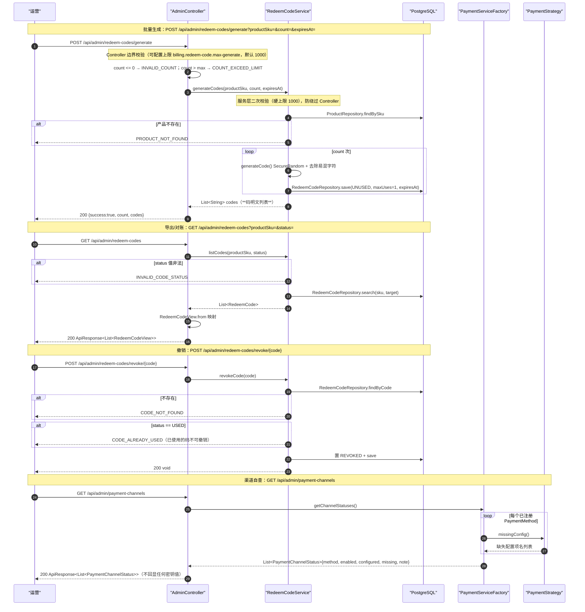
```mermaid
sequenceDiagram
    autonumber
    participant OP as "运营"
    participant AC as "AdminController"
    participant RS as "RedeemCodeService"
    participant DB as "PostgreSQL"
    participant PF as "PaymentServiceFactory"
    participant ST as "PaymentStrategy"

    Note over OP,DB: 批量生成：POST /api/admin/redeem-codes/generate?productSku=&count=&expiresAt=
    OP->>AC: POST /api/admin/redeem-codes/generate
    Note over AC: Controller 边界校验（可配置上限 billing.redeem-code.max-generate，默认 1000）
    AC->>AC: count <= 0 → INVALID_COUNT；count > max → COUNT_EXCEED_LIMIT
    AC->>RS: generateCodes(productSku, count, expiresAt)
    Note over RS: 服务层二次校验（硬上限 1000），防绕过 Controller
    RS->>DB: ProductRepository.findBySku
    alt 产品不存在
        RS-->>OP: PRODUCT_NOT_FOUND
    end
    loop count 次
        RS->>RS: generateCode()  SecureRandom + 去除易混字符
        RS->>DB: RedeemCodeRepository.save(UNUSED, maxUses=1, expiresAt)
    end
    RS-->>AC: List<String> codes（**码明文列表**）
    AC-->>OP: 200 {success:true, count, codes}

    Note over OP,DB: 导出/对账：GET /api/admin/redeem-codes?productSku=&status=
    OP->>AC: GET /api/admin/redeem-codes
    AC->>RS: listCodes(productSku, status)
    alt status 值非法
        RS-->>OP: INVALID_CODE_STATUS
    end
    RS->>DB: RedeemCodeRepository.search(sku, target)
    RS-->>AC: List<RedeemCode>
    AC->>AC: RedeemCodeView.from 映射
    AC-->>OP: 200 ApiResponse<List<RedeemCodeView>>

    Note over OP,DB: 撤销：POST /api/admin/redeem-codes/revoke/{code}
    OP->>AC: POST /api/admin/redeem-codes/revoke/{code}
    AC->>RS: revokeCode(code)
    RS->>DB: RedeemCodeRepository.findByCode
    alt 不存在
        RS-->>OP: CODE_NOT_FOUND
    end
    alt status == USED
        RS-->>OP: CODE_ALREADY_USED（已使用的码不可撤销）
    end
    RS->>DB: 置 REVOKED + save
    RS-->>OP: 200 void

    Note over OP,ST: 渠道自查：GET /api/admin/payment-channels
    OP->>AC: GET /api/admin/payment-channels
    AC->>PF: getChannelStatuses()
    loop 每个已注册 PaymentMethod
        PF->>ST: missingConfig()
        ST-->>PF: 缺失配置项名列表
    end
    PF-->>AC: List<PaymentChannelStatus>{method, enabled, configured, missing, note}
    AC-->>OP: 200 ApiResponse<List<PaymentChannelStatus>>（不回显任何密钥值）
```

---

### 3.12 用户端 · 自助退款（按剩余有效期折算）

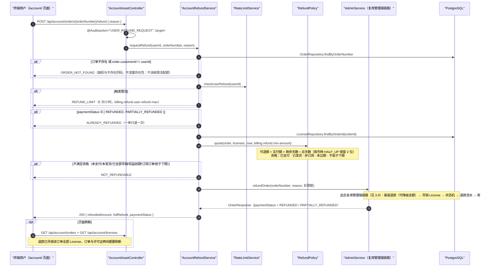
```mermaid
sequenceDiagram
    autonumber
    participant U as "终端用户（/account/ 页面）"
    participant AC as "AccountAssetController"
    participant AR as "AccountRefundService"
    participant RL as "RateLimitService"
    participant RP as "RefundPolicy"
    participant AS as "AdminService（复用管理端链路）"
    participant DB as "PostgreSQL"

    U->>AC: POST /api/account/orders/{orderNumber}/refund { reason }
    AC->>AC: @Audit(action="USER_REFUND_REQUEST", target=#orderNumber, detail=#body.reason)
    AC->>AR: requestRefund(userId, orderNumber, reason)

    AR->>DB: OrderRepository.findByOrderNumber
    alt 订单不存在 或 order.customerId != userId
        AR-->>U: ORDER_NOT_FOUND（越权与不存在同码，不泄露存在性；不消耗限流配额）
    end

    AR->>RL: checkUserRefund(userId)
    alt 触发限流
        AR-->>U: REFUND_LIMIT（5 次/小时，billing.refund.user-refund-max）
    end

    alt paymentStatus ∈ { REFUNDED, PARTIALLY_REFUNDED }
        AR-->>U: ALREADY_REFUNDED（一单只退一次）
    end

    AR->>DB: LicenseRepository.findByOrderId(orderId)
    AR->>RP: quote(order, licenses, now, billing.refund.min-amount)
    Note over RP: 可退额 = 实付额 × 剩余天数 ÷ 总天数（按币种 HALF_UP 保留 2 位）<br/>资格：已支付 · 已发货 · 非订阅 · 未过期 · 不低于下限
    alt 不满足资格（未支付/未发货/已全部吊销/权益到期/订阅订单/低于下限）
        AR-->>U: NOT_REFUNDABLE
    end

    AR->>AS: refundOrder(orderNumber, reason, 折算额)
    Note over AS,DB: 此后复用管理端链路（见 3.9）：渠道退款（可降级全额）→ 吊销 License → 状态机 → 退款流水 → 邮件
    AS-->>AR: OrderResponse（paymentStatus = REFUNDED / PARTIALLY_REFUNDED）
    AR-->>U: 200 { refundedAmount, fullRefund, paymentStatus }
    opt 页面刷新
        U->>AC: GET /api/account/orders + GET /api/account/licenses
        Note over U,AC: 退款已吊销该订单全部 License，订单与许可证两块都要刷新
    end
```

> **回报口径**：`refundedAmount` / `fullRefund` 取**实际结果**而非申请口径——若发生「渠道不受理部分金额 → 降级全额退」，回报的即为全额。
>
> **折算基数**：总天数取该订单名下全部 License 的 `max(expiresAt) − min(issuedAt)`（一单可签发多张），对用户取最长期限。

---

### 3.13 公开端 · 凭证激活（统一入口）

`POST /api/licenses/activate` —— 总览见 §1.7.6，此处只展开**服务端分流与边界判定**。

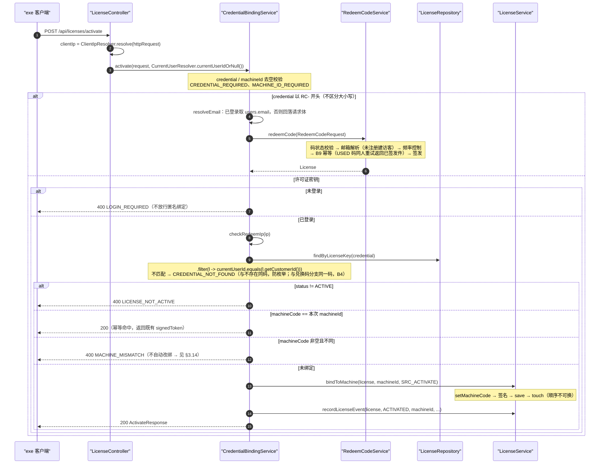
```mermaid
sequenceDiagram
    autonumber
    participant C as "exe 客户端"
    participant LC as "LicenseController"
    participant CBS as "CredentialBindingService"
    participant RCS as "RedeemCodeService"
    participant LR as "LicenseRepository"
    participant LS as "LicenseService"

    C->>LC: POST /api/licenses/activate
    LC->>LC: clientIp = ClientIpResolver.resolve(httpRequest)
    LC->>CBS: activate(request, CurrentUserResolver.currentUserIdOrNull())
    Note over CBS: credential / machineId 去空校验<br/>CREDENTIAL_REQUIRED、MACHINE_ID_REQUIRED

    alt credential 以 RC- 开头（不区分大小写）
        CBS->>CBS: resolveEmail：已登录取 users.email，否则回落请求体
        CBS->>RCS: redeemCode(RedeemCodeRequest)
        Note over RCS: 码状态校验 → 邮箱解析（未注册建访客）→ 频率控制<br/>→ B9 幂等（USED 码同人重试返回已签发件）→ 签发
        RCS-->>CBS: License
    else 许可证密钥
        alt 未登录
            CBS-->>C: 400 LOGIN_REQUIRED（不放行匿名绑定）
        else 已登录
            CBS->>CBS: checkRedeemIp(ip)
            CBS->>LR: findByLicenseKey(credential)
            Note over CBS: .filter(l -> currentUserId.equals(l.getCustomerId()))<br/>不匹配 → CREDENTIAL_NOT_FOUND（与不存在同码，防枚举；与兑换码分支同一码，B4）
            alt status != ACTIVE
                CBS-->>C: 400 LICENSE_NOT_ACTIVE
            else machineCode == 本次 machineId
                CBS-->>C: 200（幂等命中，返回既有 signedToken）
            else machineCode 非空且不同
                CBS-->>C: 400 MACHINE_MISMATCH（不自动改绑 → 见 §3.14）
            else 未绑定
                CBS->>LS: bindToMachine(license, machineId, SRC_ACTIVATE)
                Note over LS: setMachineCode → 签名 → save → touch（顺序不可换）
                CBS->>LS: recordLicenseEvent(license, ACTIVATED, machineId, ...)
                CBS-->>C: 200 ActivateResponse
            end
        end
    end
```

> **为什么绑定与签名必须收敛到内核**：`set machineCode → 签发 → save → registry.touch` 这套序列
> 原在购买直签、兑换、管理端签发三处各写一份。两套拷贝必然漂移，最终出现「一边幂等、一边重复签发」的资损级不一致。
> 内核只统管绑定与签名，**事件留痕仍归各调用方**（不同路径语义不同：`ISSUED` / `REDEEMED` / `ACTIVATED`）。

### 3.14 用户端 · 账号页自助解绑（换机恢复路径）

`POST /api/account/licenses/{licenseKey}/unbind` —— 决策 B6 的出口：§3.13 在「已绑他机」时**拒绝而非自动改绑**，
若无本端点，那条 `MACHINE_MISMATCH` 提示就是死路。

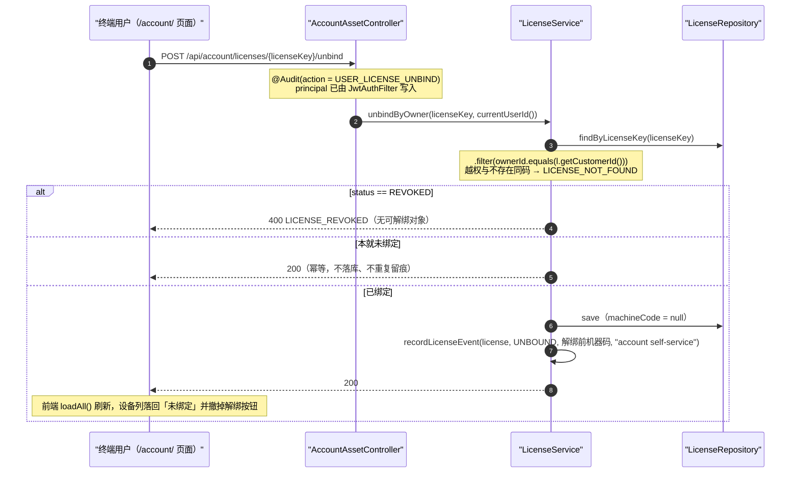
```mermaid
sequenceDiagram
    autonumber
    participant U as "终端用户（/account/ 页面）"
    participant AC as "AccountAssetController"
    participant LS as "LicenseService"
    participant LR as "LicenseRepository"

    U->>AC: POST /api/account/licenses/{licenseKey}/unbind
    Note over AC: @Audit(action = USER_LICENSE_UNBIND)<br/>principal 已由 JwtAuthFilter 写入
    AC->>LS: unbindByOwner(licenseKey, currentUserId())

    LS->>LR: findByLicenseKey(licenseKey)
    Note over LS: .filter(ownerId.equals(l.getCustomerId()))<br/>越权与不存在同码 → LICENSE_NOT_FOUND
    alt status == REVOKED
        LS-->>U: 400 LICENSE_REVOKED（无可解绑对象）
    else 本就未绑定
        LS-->>U: 200（幂等，不落库、不重复留痕）
    else 已绑定
        LS->>LR: save（machineCode = null）
        LS->>LS: recordLicenseEvent(license, UNBOUND, 解绑前机器码, "account self-service")
        LS-->>U: 200
        Note over U: 前端 loadAll() 刷新，设备列落回「未绑定」并撤掉解绑按钮
    end
```

> **归属凭证为「登录态 + 归属」**（`License.customerId == 登录 userId`）：适用于**换机后旧令牌落在旧机器上**、
> 客户端无法自行解绑的场景。只清 `machineCode`，不吊销授权本身。
>
> 注：此前另有一条凭「旧授权签名 token」解绑的公开端点 `POST /api/licenses/unbind`，因**不在 `SecurityConfig`
> 白名单内而始终 403 不可达**，已按 plan-7.0 / B10 删除（端点与 `LicenseService.unbindDevice`、`UnbindRequest` 一并移除）。
> 解绑现有两个入口：本端点（账号侧自助）与 `POST /api/admin/licenses/{licenseKey}/unbind`（管理端客服代劳）。

---

### 3.15 账号登录 · 二次因子分支（plan-7.0 / B8）

密码校验通过后**分两条路**：账号未开启 MFA → 直接签发访问令牌；已开启 → 只发一次性票据，第二因子过了才发令牌。

```mermaid
sequenceDiagram
    autonumber
    participant C as "客户端 / 管理台"
    participant AC as "AccountController"
    participant AS as "AccountService"
    participant MTS as "MfaTicketService"
    participant AMC as "AccountMfaController"
    participant MS as "MfaService"
    participant TS as "TotpService"

    C->>AC: POST /api/account/login {email, password}
    AC->>AS: login(email, password, ip)
    AS->>AS: 账号锁定 / IP 限流 / 密码比对 / 状态校验
    alt 未开启 MFA
        AS->>AS: jwtTokenService.issue(userId, tokenVersion)
        AS-->>C: 200 {accessToken, expiresIn, user, mfaRequired=false}
    else 已开启 MFA
        Note over AS: 不签发访问令牌 —— 只在服务端强制第二因子<br/>否则绕过管理台直调 login 即可拿到令牌
        AS->>MTS: issue(userId, tokenVersion)
        Note over MTS: 独立派生密钥签名（HMAC-SHA256(mfaKey,"mfa-ticket-v1")）<br/>故票据**无法**通过 JwtTokenService.parse → 不可能被当访问令牌用
        MTS-->>AS: mfaTicket（300 秒，含 sub + ver）
        AS-->>C: 200 {accessToken=null, user=null, mfaRequired=true, mfaTicket, mfaMethods}
    end

    Note over C: 进入第二步：输入认证器动态码<br/>（或点「改用邮箱验证码」→ ㉟）
    C->>AMC: POST /api/account/mfa/verify {ticket, code}
    Note over AMC: permitAll + 方法内验票据（此端点须声明在 /api/account/** 规则之前，否则死锁）
    AMC->>MS: verify(ticket, code)
    MS->>MTS: parse(ticket)
    MTS-->>MS: userId + ver
    MS->>MS: 比对 ver == user.tokenVersion（改密即失效）<br/>校验账号状态 / 失败计数（verify-fail-max）
    MS->>TS: verify(解密后的 secret, code, lastUsedStep)
    Note over TS: 容错 ±1 步；已用过的 step 拒绝（防重放，RFC 6238 §5.2）
    alt 动态码未中且邮箱兜底开启
        MS->>MS: 校验 LOGIN_MFA 验证码（用途码只由本链路签发）
    end
    alt 通过
        MS->>MS: jwtTokenService.issue(userId, tokenVersion)
        MS-->>C: 200 {accessToken, expiresIn, user, mfaRequired=false}
    else 不通过
        MS-->>C: 400 MFA_CODE_INVALID / MFA_VERIFY_LIMIT / MFA_TICKET_INVALID
    end
```

> **票据密钥必须与 `account.jwt-secret` 隔离**：`JwtAuthFilter` 只看 `sub` + `ver` + 签名，若票据复用同一密钥，
> 票据本身就是一枚合法访问令牌——攻击者拿票据直接调 `/api/admin/**`，MFA 被整体绕过。此点由
> `MfaTicketServiceTest` 的机械断言锁住（票据不得通过 `JwtTokenService.parse`）。

---

## 四、接口入参示例（42 个端点）

> 契约以代码为准：字段定义见 `dto/`（`@Schema` 注解）与 `controller/` 的参数声明；curl 示例与 [`README.md`](./README.md)「API 接口」段同源。
> 除 `/api/webhooks/**` 外，响应均被 `ApiResponseAdvice` 包为统一响应壳（见 `README.md`「响应结构」），故成功响应不再逐条重复；仅标注需要关注的响应要点。

### 4.1 收银台（公开）

#### ① `POST /api/checkout/create` — 创建收银台会话

请求体（`dto/CheckoutRequest`，`Content-Type: application/json`）：

| 字段 | 类型 | 必填 | 说明 |
|---|---|---|---|
| `productId` | string | ✅ | 产品 SKU；种子数据 `pro-buyout` / `pro-plus-buyout` / `pro-subscription` / `pro-plus-subscription`。不存在 / 未上架 / 区域价未配置 → `PRODUCT_NOT_FOUND` / `PRODUCT_INACTIVE` / `PRICE_NOT_CONFIGURED` |
| `currency` | string | — | `CNY` / `USD` |
| `locale` | string | — | 如 `zh-CN`；与 `currency` 共同决定区域（`currency=CNY` 或 `locale` 以 `zh` 开头 → 国内） |
| `machineId` | string | — | 传入则支付后**直接签发绑定设备的 License**；不传则生成兑换码 |
| `email` | string | — | 发货通知收件人；受邮箱购买频控（`EMAIL_PURCHASE_LIMIT`） |
| `returnUrl` / `cancelUrl` | string | — | 网页支付回跳地址 |
| `customerEmail` | string(email) | — | 对外客户标识（E2，2026-09-18 邮箱化）；不传/空 → `EMAIL_REQUIRED`；格式非法 → `INVALID_EMAIL`；未注册邮箱自动建访客账户（解析为该账户 userId） |
| `provider` | string | — | 传入即**一步下单**（见 §1.7.1）；取值 `alipay` / `wechat_pay` / `stripe` / `paddle` / `paypal`，不区分大小写 |

```bash
# 两步下单：先拿可用渠道列表（带 provider 则一步下单，响应直接含二维码/跳转链接）
curl -X POST http://localhost:8000/api/checkout/create \
  -H "Content-Type: application/json" \
  -d '{
    "productId": "pro-buyout",
    "currency": "CNY",
    "locale": "zh-CN",
    "machineId": "ABCD-1234-EFGH-5678",
    "email": "buyer@example.com",
    "customerEmail": "buyer@example.com",
    "returnUrl": "https://pay.example.com/success",
    "cancelUrl": "https://pay.example.com/cancel"
  }'
```

#### ② `POST /api/checkout/{checkoutId}/select-provider` — 选择支付方式

路径参数 `checkoutId`（string，必填）；请求体 `dto/SelectProviderRequest`：

```bash
curl -X POST "http://localhost:8000/api/checkout/cs_9f8e7d6c5b4a/select-provider" \
  -H "Content-Type: application/json" \
  -d '{"provider": "alipay"}'
```

> `provider` **必填**；非法值 → `UNSUPPORTED_PROVIDER`，渠道已注册但未启用 → `ChannelDisabledException`（400）。
> 响应 `paymentMode=qrcode` 时取 `qrcode` 渲染；`paymentMode=redirect` 时取 `redirectUrl` 跳转。

#### ③ `GET /api/checkout/{checkoutId}/status` — 轮询支付状态

```bash
curl "http://localhost:8000/api/checkout/cs_9f8e7d6c5b4a/status"
```

> 无请求体、无查询参数。渠道确认已支付后，`data` 含 `license`（signedToken）或 `redeemCode`。

### 4.2 兑换码兑换（公开）

#### ④ `POST /api/redeem/redeem`

请求体（`dto/RedeemCodeRequest`）：

| 字段 | 类型 | 必填 | 说明 |
|---|---|---|---|
| `code` | string | ✅ | 兑换码明文；**未知码 → `CREDENTIAL_NOT_FOUND`（与 ㉝ 激活端点同码，B4）**；已使用 / 已过期 → `CODE_ALREADY_USED` / `CODE_EXPIRED` |
| `customerEmail` | string(email) | — | 对外客户标识（E2，2026-09-18 邮箱化）；不传/空 → `EMAIL_REQUIRED`；格式非法 → `INVALID_EMAIL`；未注册邮箱自动建访客账户（解析为该账户 userId） |
| `machineId` | string | — | 传入则 License 绑定该设备 |

> `clientIp` **不在请求体中**：该字段由服务端按真实连接地址填充（`@JsonIgnore` + `@Schema(hidden = true)`），客户端传入无效。

```bash
curl -X POST http://localhost:8000/api/redeem/redeem \
  -H "Content-Type: application/json" \
  -d '{
    "code": "K7D2-9FQA-M3PZ-88BC",
    "customerEmail": "buyer@example.com",
    "machineId": "ABCD-1234-EFGH-5678"
  }'
```

响应 `data`（`dto/RedeemResponse`，J3 起为类型化 DTO，原为匿名 `Map`）：

| 字段 | 类型 | 说明 |
|---|---|---|
| `success` | boolean | 固定 `true`；与响应壳 `success` 同义，为兼容既有客户端保留 |
| `licenseKey` | string | License 密钥，客户端激活与在线校验用 |
| `signedToken` | string | 签名令牌（JWS Compact），供离线验签；请勿写入日志 |
| `expiresAt` | datetime / null | 过期时间（ISO-8601，无时区）；永久授权为 `null` |
| `serverTime` | number | **服务端当前时间（epoch 毫秒）**；客户端用于抬高本地单调时间下界，防「改系统时间让过期授权复活」。K4（2026-09-18）新增 |

> 客户端消费提示：业务字段在**统一壳的 `data` 段**（`ApiResponseAdvice` 包壳），即 `$.data.signedToken` / `$.data.serverTime`，**不在顶层**。客户端实现见 `ai-tools/src/main/license/redeem.ts`（兼容扁平结构）。

### 4.3 License 在线校验（公开）

#### ⑤ `GET /api/licenses/verify/{licenseKey}`

```bash
curl http://localhost:8000/api/licenses/verify/LIC-2F8A-7C31-9D04-B5E6
```

> 路径参数 `licenseKey` 必填。有效件返回完整视图（含 `signedToken`）；过期 / 吊销 / 已换机重发 → 400。

### 4.4 支付回调（公开，由渠道服务端发起）

#### ⑥–⑩ `POST /api/webhooks/{alipay|wechat|stripe|paddle|paypal}`

入参为**各渠道原始报文**，不遵循统一请求体；签名位置随渠道而异：

| 端点 | 请求体 | 签名位置 |
|---|---|---|
| `/api/webhooks/alipay` | `application/x-www-form-urlencoded` 异步通知原文 | 表单参数 `sign` |
| `/api/webhooks/wechat` | 微信支付 v3 通知 JSON | 请求头 `Wechatpay-Signature` |
| `/api/webhooks/stripe` | Stripe 事件 JSON | 请求头 `Stripe-Signature` |
| `/api/webhooks/paddle` | Paddle 事件 JSON | 请求头 `Paddle-Signature` |
| `/api/webhooks/paypal` | PayPal 事件 JSON | 请求头 `Paypal-Transmission-Id` |

> **不可用 curl 模拟**（需渠道侧真实签名），联调方式见 `scripts/README.md` 与归档 plan `plan-v2.5-t1-channel-verify.md`。
> **响应不经统一响应壳**：成功返回渠道期望的原文（微信要求 `{"code":"SUCCESS"}`），失败透传真实状态码（验签失败 401、金额不符 400），避免渠道误判投递成功而停止重试。

### 4.5 管理端 · 订单（管理员 JWT：先 `POST /api/account/login` 拿 `accessToken`，再带 `Authorization: Bearer`）

#### ⑪ `GET /api/admin/orders` — 订单查询

查询参数均可选；`orderNumber` / `orderId` 优先于 `status`；全部留空返回全部订单。

| 参数 | 类型 | 说明 |
|---|---|---|
| `status` | string | `PENDING` / `CONFIRMED` / `PROCESSING` / `COMPLETED` / `CANCELLED` / `REFUNDED` / `REFUND_FAILED` / `PAID`；非法值 → `INVALID_ORDER_STATUS` |
| `orderNumber` | string | 业务订单号（精确匹配） |
| `orderId` | string(uuid) | 订单 UUID（精确匹配） |

```bash
curl "http://localhost:8000/api/admin/orders?status=PAID" -H "Authorization: Bearer $ADMIN_TOKEN"
curl "http://localhost:8000/api/admin/orders?orderNumber=ORD-20260914-0001" -H "Authorization: Bearer $ADMIN_TOKEN"
```

#### ⑫ `POST /api/admin/orders/{orderNumber}/issue` — 补签发 License

```bash
curl -X POST "http://localhost:8000/api/admin/orders/ORD-20260914-0001/issue" \
  -H "Authorization: Bearer $ADMIN_TOKEN"
```

> 路径参数 `orderNumber` 必填；无请求体、无查询参数。要求订单已支付，否则 400。

#### ⑬ `POST /api/admin/orders/{orderNumber}/refund` — 退款

```bash
curl -X POST "http://localhost:8000/api/admin/orders/ORD-20260914-0001/refund?reason=用户申请" \
  -H "Authorization: Bearer $ADMIN_TOKEN"
```

> 路径参数 `orderNumber` 必填；查询参数 `reason`（可选）。退款目标交易号取自 `Payment` 实体记录。

### 4.6 管理端 · License（管理员 JWT：先 `POST /api/account/login` 拿 `accessToken`，再带 `Authorization: Bearer`）

#### ⑭ `GET /api/admin/licenses` — License 查询

| 参数 | 类型 | 说明 |
|---|---|---|
| `customerEmail` | string(email) | 客户邮箱（对外标识，E2）；只读解析为 userId，未注册 → 无匹配（不建号） |
| `orderNumber` | string | 业务订单号（优先于 `customerEmail`） |
| `status` | string | `ACTIVE` / `EXPIRED` / `REVOKED` / `REISSUED` |

```bash
curl "http://localhost:8000/api/admin/licenses?customerEmail=buyer@example.com" -H "Authorization: Bearer $ADMIN_TOKEN"
curl "http://localhost:8000/api/admin/licenses?status=REISSUED" -H "Authorization: Bearer $ADMIN_TOKEN"
```

> 返回**脱敏视图**（不含 `signedToken`），且含失效件；`customerEmail` 由 `customerId` 批量回填（`findAllById`，避免 N+1）。

#### ⑮ `GET /api/admin/licenses/{licenseKey}` — License 详情

```bash
curl "http://localhost:8000/api/admin/licenses/LIC-2F8A-7C31-9D04-B5E6" -H "Authorization: Bearer $ADMIN_TOKEN"
```

> 与公开 `verify` 的区别：本端点**不过滤状态**，可查失效件及其原因。

#### ⑯ `POST /api/admin/licenses/{licenseKey}/revoke` — 作废 License

```bash
curl -X POST "http://localhost:8000/api/admin/licenses/LIC-2F8A-7C31-9D04-B5E6/revoke?reason=违规使用" \
  -H "Authorization: Bearer $ADMIN_TOKEN"
```

> 路径参数 `licenseKey` 必填；查询参数 `reason`（可选）。成功返回 200 且**响应体为空**（`ApiResponseAdvice` 对 null 体不包壳）。

#### ⑰ `POST /api/admin/licenses/{licenseKey}/reissue` — 换机重发

```bash
curl -X POST "http://localhost:8000/api/admin/licenses/LIC-2F8A-7C31-9D04-B5E6/reissue?newMachineId=NEW-MACHINE-0001&reason=changed_pc" \
  -H "Authorization: Bearer $ADMIN_TOKEN"
```

> `newMachineId` **必填**（声明为必填查询参数，缺失即 400）；`reason` 可选。受单 License 重发次数上限约束（`LICENSE_REISSUE_LIMIT`）。

### 4.7 管理端 · 兑换码与运维（管理员 JWT：先 `POST /api/account/login` 拿 `accessToken`，再带 `Authorization: Bearer`）

#### ⑱ `POST /api/admin/redeem-codes/generate` — 批量生成兑换码

| 参数 | 类型 | 必填 | 说明 |
|---|---|---|---|
| `productSku` | string | ✅ | 产品 SKU |
| `count` | int | ✅ | 正整数；`≤ 0` → `INVALID_COUNT`，超上限（默认 1000，配置项 `billing.redeem-code.max-generate`）→ `COUNT_EXCEED_LIMIT` |
| `expiresAt` | datetime | — | ISO-8601 |

```bash
curl -X POST "http://localhost:8000/api/admin/redeem-codes/generate?productSku=pro-buyout&count=100" \
  -H "Authorization: Bearer $ADMIN_TOKEN"
# → data: {"success":true,"count":100,"codes":["K7D2-9FQA-M3PZ-88BC", ...]}
```

响应 `data`（`dto/GenerateRedeemCodesResponse`，J3 起为类型化 DTO，原为匿名 `Map`）：

| 字段 | 类型 | 说明 |
|---|---|---|
| `success` | boolean | 固定 `true`；与响应壳 `success` 同义，为兼容既有客户端保留 |
| `count` | int | 实际生成的兑换码数量 |
| `codes` | string[] | 兑换码明文列表（顺序即生成顺序）；**明文仅此一次返回**，事后对账用 ⑲ |

#### ⑲ `GET /api/admin/redeem-codes` — 导出 / 对账

```bash
curl "http://localhost:8000/api/admin/redeem-codes?productSku=pro-buyout&status=UNUSED" \
  -H "Authorization: Bearer $ADMIN_TOKEN"
```

> `productSku` 与 `status`（`UNUSED` / `USED` / `EXPIRED` / `REVOKED`）均可选；非法状态 → `INVALID_CODE_STATUS`。

#### ⑳ `POST /api/admin/redeem-codes/revoke/{code}` — 撤销兑换码

```bash
curl -X POST "http://localhost:8000/api/admin/redeem-codes/revoke/K7D2-9FQA-M3PZ-88BC" \
  -H "Authorization: Bearer $ADMIN_TOKEN"
```

> 路径参数 `code` 必填；已使用（`USED`）的码不可撤销。

#### ㉑ `GET /api/admin/payment-channels` — 支付渠道配置自查

```bash
curl "http://localhost:8000/api/admin/payment-channels" -H "Authorization: Bearer $ADMIN_TOKEN"
```

> 无参数。返回各渠道 `{method, enabled, configured, missingConfig, note}`，仅暴露缺失配置项名，不回显任何密钥值。

### 4.8 账号（v2.10 新增，7 个端点）

> A4 登出 / A5 me / A6 改密 需请求头 `Authorization: Bearer <accessToken>`；其余 4 个为公开端点。

#### ㉒ `POST /api/account/verification-code` — 发送邮箱验证码

| 字段 | 类型 | 必填 | 说明 |
|---|---|---|---|
| `email` | string | ✅ | 邮箱格式；服务端统一转小写 |
| `purpose` | string | ✅ | `REGISTER` / `RESET_PASSWORD` |

```bash
curl -X POST http://localhost:8000/api/account/verification-code \
  -H "Content-Type: application/json" \
  -d '{"email":"user@example.com","purpose":"REGISTER"}'
# → data 为 null；联调模式（ACCOUNT_CODE_LOG_ONLY=true）验证码写日志：
#   [code-log-only] 验证码已生成：email=..., purpose=REGISTER, code=483920
```

> 签发新码会作废同邮箱同用途的旧未消费码，任何时刻最多一个有效码。触发限流 → `CODE_SEND_TOO_FREQUENT`。

#### ㉓ `POST /api/account/register` — 注册

| 字段 | 类型 | 必填 | 说明 |
|---|---|---|---|
| `email` | string | ✅ | 未被注册 |
| `password` | string | ✅ | 8–72 位，含字母与数字（`account.password-*` 可配） |
| `emailCode` | string | ✅ | `purpose=REGISTER` 的验证码；一次性消费 |

```bash
curl -X POST http://localhost:8000/api/account/register \
  -H "Content-Type: application/json" \
  -d '{"email":"user@example.com","password":"Passw0rd2026","emailCode":"483920"}'
# → data: {"accessToken":"eyJhbGciOi...","expiresIn":604800,"user":{...}}
```

> `data.user` 与 ㉖ `me` 同结构（`dto/UserProfileResponse`）。注册成功即已登录，无需再调 login。

#### ㉔ `POST /api/account/login` — 登录

```bash
curl -X POST http://localhost:8000/api/account/login \
  -H "Content-Type: application/json" \
  -d '{"email":"user@example.com","password":"Passw0rd2026"}'
```

> 邮箱不存在与密码错误**都返回 `INVALID_CREDENTIALS`**（不区分，防账号枚举）。同一账号连续失败 5 次 → `ACCOUNT_LOCKED` 锁定 15 分钟（落库）。

#### ㉕ `POST /api/account/logout` — 登出（需登录）

```bash
curl -X POST http://localhost:8000/api/account/logout \
  -H "Authorization: Bearer <accessToken>"
```

> `tokenVersion` +1 → 该用户**所有**已签发令牌立即失效（不限当前这一台）。`data` 为 null。

#### ㉖ `GET /api/account/me` — 当前用户（需登录）

```bash
curl http://localhost:8000/api/account/me -H "Authorization: Bearer <accessToken>"
# → data: {"id":"8b2c4d6e-...","email":"user@example.com","emailVerified":true,
#          "status":"ACTIVE","createdAt":"2026-09-15T01:30:00","lastLoginAt":"2026-09-15T09:12:44"}
```

> 无请求参数。`data.id` 即 `Order.customerId`（决策 1）。

#### ㉗ `POST /api/account/password/change` — 改密（需登录）

| 字段 | 类型 | 必填 | 说明 |
|---|---|---|---|
| `oldPassword` | string | ✅ | 不匹配 → `OLD_PASSWORD_MISMATCH` |
| `newPassword` | string | ✅ | 不得与旧密码相同；须满足密码策略 |

```bash
curl -X POST http://localhost:8000/api/account/password/change \
  -H "Authorization: Bearer <accessToken>" -H "Content-Type: application/json" \
  -d '{"oldPassword":"Passw0rd2026","newPassword":"NewPassw0rd2026"}'
```

> 成功后 `tokenVersion` +1，**需重新登录**。

#### ㉘ `POST /api/account/password/reset` — 找回密码（公开）

| 字段 | 类型 | 必填 | 说明 |
|---|---|---|---|
| `email` | string | ✅ | 注册邮箱 |
| `code` | string | ✅ | `purpose=RESET_PASSWORD` 的验证码 |
| `newPassword` | string | ✅ | 须满足密码策略 |

```bash
curl -X POST http://localhost:8000/api/account/password/reset \
  -H "Content-Type: application/json" \
  -d '{"email":"user@example.com","code":"483920","newPassword":"NewPassw0rd2026"}'
```

> 邮箱未注册时同样落到 `CODE_INVALID`（不暴露账号是否存在）。成功后该用户所有令牌失效。

### 4.9 我的资产与自助退款（需登录：`Authorization: Bearer <accessToken>`）

> U1/U2 起登录用户可自助查看本人 License / 订阅 / 订单；并支持订单自助退款（按剩余有效期折算）。
> 全部挂在 `/api/account/**`（`ROLE_USER` 保护区），`SecurityConfig` 零新增规则；管理员兼授 `ROLE_USER`（B1）故同样可用。

#### ㉙ `GET /api/account/licenses` — 我的 License

无请求参数。返回本人名下全部 License（签发时间倒序）：`licenseKey` **完整回显**（激活所需），
离线验签 `signedToken` **不外发**（与管理端同口径）。

```bash
curl http://localhost:8000/api/account/licenses -H "Authorization: Bearer <accessToken>"
# → data: [{"licenseKey":"LIC-2F8A-...","productSku":"pro-buyout","status":"ACTIVE",
#           "issuedAt":"...","expiresAt":"...","machineCode":"5E01-..."}]
```

#### ㉚ `GET /api/account/subscriptions` — 我的订阅

无请求参数。返回本人订阅（创建时间倒序），含渠道、状态、产品 SKU/名称、当前周期与是否到期取消。

```bash
curl http://localhost:8000/api/account/subscriptions -H "Authorization: Bearer <accessToken>"
```

#### ㉛ `GET /api/account/orders` — 我的订单（含可退标记）

无请求参数。除订单字段外，另回填两个**仅此端点返回**的字段，供前端决定是否显示退款入口：

| 字段 | 类型 | 说明 |
|---|---|---|
| `refundable` | boolean | 是否可自助退款（由 `RefundPolicy` 折算判定）；管理端端点返回 `null`（不适用） |
| `refundableAmount` | number | 折算后可退额；不可退时为 `null` |

```bash
curl http://localhost:8000/api/account/orders -H "Authorization: Bearer <accessToken>"
# → data: [{"orderNumber":"ORD2026...","totalAmount":99.00,"paymentStatus":"PAID",
#           "refundable":true,"refundableAmount":93.02}]
```

#### ㉜ `POST /api/account/orders/{orderNumber}/refund` — 申请退款

| 字段 | 类型 | 必填 | 说明 |
|---|---|---|---|
| `reason` | string | ❌ | 退款原因（≤200 字），用于审计与退款通知文案 |

```bash
curl -X POST http://localhost:8000/api/account/orders/ORD20260914224937123/refund \
  -H "Authorization: Bearer <accessToken>" -H "Content-Type: application/json" \
  -d '{"reason":"买错了版本"}'
# → data: {"orderNumber":"ORD20260914224937123","refundedAmount":91.20,
#          "fullRefund":false,"paymentStatus":"PARTIALLY_REFUNDED"}
```

**错误码**：`ORDER_NOT_FOUND`（订单不存在**或**非本人，不泄露存在性）、`NOT_REFUNDABLE`（未支付/未发货/权益到期/订阅订单/低于下限）、
`ALREADY_REFUNDED`（一单只退一次）、`REFUND_LIMIT`（5 次/小时）、`REFUND_FAILED`（渠道退款未成功，须人工介入）。

> 退款成功后**立即吊销该订单全部 License**；如需改用套餐请重新购买。

### 4.10 凭证激活与设备解绑（plan-7.0 方案 A）

> 激活是**公开端点但可选鉴权**（兑换码分支匿名可调、许可证密钥分支必须登录）；解绑在 `/api/account/**`（`ROLE_USER`）。
> 两者成对：激活在「已绑他机」时拒绝，解绑即为那条拒绝提示的恢复出口。

#### ㉝ `POST /api/licenses/activate` — 凭证激活（统一入口）

请求体（`dto/ActivateRequest`）：

| 字段 | 类型 | 必填 | 说明 |
|---|---|---|---|
| `credential` | string | ✅ | 兑换码（`RC-` 前缀）或许可证密钥；服务端按格式自动识别。空 → `CREDENTIAL_REQUIRED` |
| `machineId` | string | ✅ | 待绑定的客户端机器码。空 → `MACHINE_ID_REQUIRED` |
| `customerEmail` | string(email) | — | **仅兑换码分支且未登录时**需要（识别兑换人）；已登录时**以登录账号邮箱为准**，本字段被忽略 |

> `clientIp` **不在请求体中**（`@JsonIgnore` + `@Schema(hidden = true)`），由服务端按真实连接地址填充——防伪造 IP 绕过限流。

```bash
# ① 许可证密钥激活（须登录；未登录 → LOGIN_REQUIRED）
curl -X POST http://localhost:8000/api/licenses/activate \
  -H "Content-Type: application/json" \
  -H "Authorization: Bearer <accessToken>" \
  -d '{"credential":"LIC-2F8A-7C31-9D04-B5E6","machineId":"ABCD-1234-EFGH-5678"}'

# ② 兑换码激活（匿名，与 ④ POST /api/redeem/redeem 等价）
curl -X POST http://localhost:8000/api/licenses/activate \
  -H "Content-Type: application/json" \
  -d '{"credential":"RC-8F3C-1D2E-9A4B","machineId":"ABCD-1234-EFGH-5678",
       "customerEmail":"buyer@example.com"}'
```

响应 `data`（`dto/ActivateResponse`，两条分支统一合同，口径对齐 `RedeemResponse`）：

| 字段 | 类型 | 说明 |
|---|---|---|
| `success` | boolean | 固定 `true`；与响应壳 `success` 同义，为兼容既有客户端保留 |
| `licenseKey` | string | License 密钥，客户端激活与在线校验用 |
| `signedToken` | string | 签名令牌（JWS Compact），供离线验签；请勿写入日志 |
| `status` | string | `ACTIVE` / `EXPIRED` / `REVOKED` / `REISSUED` |
| `machineId` | string | 本次绑定生效的机器码 |
| `expiresAt` | datetime / null | 过期时间；永久授权为 `null` |
| `serverTime` | number | 服务端当前时间（epoch 毫秒），防「改系统时间让过期授权复活」 |

**错误码**（按分支与语义类分组）：

| 语义类 | 兑换码分支 | 许可证密钥分支 |
|---|---|---|
| 入参缺失 | `CREDENTIAL_REQUIRED` / `MACHINE_ID_REQUIRED`（共用） | 同左 |
| **凭证不认识** | **`CREDENTIAL_NOT_FOUND`** | **`CREDENTIAL_NOT_FOUND`**（密钥不存在**或**非本人，同码返回不泄露存在性） |
| 凭证状态 | `CODE_ALREADY_USED` / `CODE_EXPIRED` | `LICENSE_NOT_ACTIVE` |
| 设备绑定 | — | `MACHINE_MISMATCH`（已绑他机，**不自动改绑** → 见 ㉞） |
| 身份 | `EMAIL_REQUIRED` / `INVALID_EMAIL`（未登录且未传邮箱 / 邮箱非法） | `LOGIN_REQUIRED` |
| 风控 | `REDEEM_IP_LIMIT` / `REDEEM_BRUTE_FORCE`（共用；档位沿用兑换侧：20 次/10 分钟、失败 10 次/10 分钟锁定） | 同左 |

> **B4（2026-09-23）：「凭证不认识」已统一为 `CREDENTIAL_NOT_FOUND`**。此前密钥分支返回 `LICENSE_NOT_FOUND`、
> 兑换分支返回 `CODE_NOT_FOUND`，客户端对接两个端点要认两个码。现由 `RedeemCodeService.doRedeem` 与
> `CredentialBindingService` 各出一处即完成统一——**不在激活层加「异常码翻译层」**，那本身是新漂移源。
> 本轮**只统一「凭证不认识」这一类**：`CODE_ALREADY_USED` / `CODE_EXPIRED` / `LICENSE_NOT_ACTIVE` 描述的是
> **凭证状态**而非识别失败，语义不同，保持原码。
>
> 另注：同为「密钥不存在」的 `GET /api/licenses/verify/{licenseKey}` 仍返回 `LICENSE_NOT_FOUND`（属第三个端点，
> 不在本次两端点范围）；管理端撤销兑换码 `revokeCode` 亦保留 `CODE_NOT_FOUND`。

> 幂等：已绑定**同一机器**时直接返回既有 `signedToken`，**不二次签发**。

#### ㉞ `POST /api/account/licenses/{licenseKey}/unbind` — 释放设备绑定（需登录）

无请求体。路径参数 `licenseKey` 必填。

```bash
curl -X POST http://localhost:8000/api/account/licenses/LIC-2F8A-7C31-9D04-B5E6/unbind \
  -H "Authorization: Bearer <accessToken>"
# → 200（data 为 null）
```

**错误码**：`LICENSE_NOT_FOUND`（密钥不存在**或**非本人，同码返回）、`LICENSE_REVOKED`（已吊销件无可解绑对象）。
本就未绑定时**幂等返回 200**（不落库、不重复留痕）。

> 与 ㉝ 的 `CREDENTIAL_NOT_FOUND` **刻意不同码**：本端点是「资产操作」（针对本人名下某个具体 License），
> 而 ㉝ 是「凭证识别」（一个可猜测的明文凭证能否换到绑定）。前者可由 `account.js` 按码映射文案
> 「许可证不存在或不属于当前账号」，后者刻意不区分「不存在/非本人」（防枚举）。

> 只清 `machineCode`（事件留痕 `UNBOUND`），**不吊销授权本身**；解绑后即可用 ㉝ 把该授权激活到新设备。

### 4.11 二次因子（MFA，plan-7.0 / B8）

> 前两个端点为**半认证**（`permitAll` + 方法内验票据）：调用者手里只有一枚「密码已通过」的一次性票据，
> 还没有访问令牌；后四个端点在 `/api/admin/**` 下，由框架统一要求 `ROLE_ADMIN`。

#### ㉟ `POST /api/account/mfa/challenge` — 发送邮箱兜底验证码（凭票据）

```json
{ "ticket": "eyJhbGciOiJIUzI1NiJ9..." }
```

```bash
curl -X POST http://localhost:8000/api/account/mfa/challenge \
  -H "Content-Type: application/json" -d '{"ticket":"eyJ..."}'
# → 200（data 为 null）
```

**错误码**：`MFA_TICKET_INVALID`、`MFA_NOT_ENABLED`、`MFA_EMAIL_FALLBACK_DISABLED`（服务端关闭了邮箱兜底）、
`CODE_SEND_TOO_FREQUENT`（沿用账号验证码的邮箱冷却与窗口阈值）。

#### ㊱ `POST /api/account/mfa/verify` — 校验第二因子并换取令牌（凭票据）

```json
{ "ticket": "eyJhbGciOiJIUzI1NiJ9...", "code": "123456" }
```

**响应**：与登录同构的 `AuthResponse`，**此处 `accessToken` 与 `user` 才非空**。

```bash
curl -X POST http://localhost:8000/api/account/mfa/verify \
  -H "Content-Type: application/json" -d '{"ticket":"eyJ...","code":"123456"}'
# → data: {"accessToken":"eyJ...","expiresIn":604800,"user":{...,"role":"ADMIN"},
#          "mfaRequired":false,"mfaTicket":null,"mfaMethods":null}
```

**错误码**：`MFA_TICKET_INVALID`（无效 / 过期 / `tokenVersion` 已变）、`MFA_NOT_ENABLED`、
`MFA_CODE_INVALID`（动态码与邮箱码**都不匹配**才算一次失败）、`MFA_VERIFY_LIMIT`（失败达 `verify-fail-max`）、
`MFA_SECRET_UNREADABLE`（密文损坏或 `ACCOUNT_MFA_KEY` 已轮换）、`ACCOUNT_DISABLED`。

#### ㊲ `GET /api/admin/mfa/status` — 查询绑定状态

无请求体、无路径参数。**响应不含任何密钥材料**。

```bash
curl http://localhost:8000/api/admin/mfa/status -H "Authorization: Bearer <admin-token>"
# → data: {"enabled":true,"enrolledAt":"2026-09-23T11:20:31","emailFallbackEnabled":true}
```

#### ㊳ `POST /api/admin/mfa/enroll` — 生成密钥（须当前密码）

```bash
curl -X POST http://localhost:8000/api/admin/mfa/enroll \
  -H "Authorization: Bearer <admin-token>" -H "Content-Type: application/json" \
  -d '{"password":"Passw0rd2026"}'
# → data: {"secret":"JBSWY3DPEHPK3PXP","otpauthUri":"otpauth://totp/...","activated":false}
```

**错误码**：`OLD_PASSWORD_MISMATCH`、`MFA_ALREADY_ENABLED`（重新绑定须先解绑）、`MFA_VERIFY_LIMIT`。

> `secret` / `otpauthUri` **仅此一次回显**，库中只存 AES-256-GCM 密文；故页面刷新即须重新生成。

#### ㊴ `POST /api/admin/mfa/activate` — 激活（认证器动态码）

```bash
curl -X POST http://localhost:8000/api/admin/mfa/activate \
  -H "Authorization: Bearer <admin-token>" -H "Content-Type: application/json" \
  -d '{"code":"123456"}'
# → 200（data 为 null）
```

**错误码**：`MFA_NOT_ENROLLED`（未先 enroll）、`MFA_CODE_INVALID`、`MFA_VERIFY_LIMIT`。

#### ㊵ `POST /api/admin/mfa/unbind` — 解绑（须密码 + 动态码/邮箱码）

```bash
curl -X POST http://localhost:8000/api/admin/mfa/unbind \
  -H "Authorization: Bearer <admin-token>" -H "Content-Type: application/json" \
  -d '{"password":"Passw0rd2026","code":"123456"}'
# → 200（data 为 null）
```

**错误码**：`MFA_NOT_ENABLED`、`OLD_PASSWORD_MISMATCH`、`MFA_CODE_INVALID`、`MFA_VERIFY_LIMIT`。

> **两道校验不可删**：只验密码则 session 被劫持后可静默关掉整道防线；只验动态码则密码泄漏即可关。
> 解绑**不**递增 `tokenVersion`（属保护等级下降，非账号异常）。

### 4.12 管理端 · License 处置（plan-7.0 主体三）

> 三者语义不同，售后须按实际情况择一。管理台「License 处置」分区即这三个动作的界面入口。

#### ㊶ `POST /api/admin/licenses/{licenseKey}/unbind` — 解绑设备（保留授权）

```bash
curl -X POST "http://localhost:8000/api/admin/licenses/{licenseKey}/unbind?reason=用户换机" \
  -H "Authorization: Bearer $ADMIN_TOKEN"
# → 200（data 为 null）
```

**错误码**：`LICENSE_NOT_FOUND`（密钥不存在，**做归属无关的精确匹配**）、`LICENSE_REVOKED`（已作废件无可解绑对象）。
本就未绑定时**幂等返回 200**（不落库、不重复留痕）。
留痕：`license_events` 记 `UNBOUND`，机器码取**解绑前**值，detail 形如 `Device binding released by admin. reason=…`。

> **与账号侧 ㉞ 的分工**：㉞ 要求「登录态 + 归属」（用户自助）；本端点供管理员处置——典型场景是
> 用户换机后旧令牌随旧机器失效、登不进账号页，客服只能代其释放绑定。故本端点**不做归属校验**，
> 把门交给 `/api/admin/**` 的 `ROLE_ADMIN` 框架授权。
> ⚠️ **本端点不吊销授权**——若需终止用户权益，用 `revoke`；若需换机并换新密钥，用 `reissue`。

#### `POST /api/admin/licenses/{licenseKey}/reissue` — 失效重发（参数已更新）

```bash
# 绑新机（常规）
curl -X POST "http://localhost:8000/api/admin/licenses/{licenseKey}/reissue?newMachineId=NEW-MACHINE&reason=changed_pc" \
  -H "Authorization: Bearer $ADMIN_TOKEN"
# 只失效重发、不绑设备（newMachineId 留空）
curl -X POST "http://localhost:8000/api/admin/licenses/{licenseKey}/reissue?reason=reset" \
  -H "Authorization: Bearer $ADMIN_TOKEN"
# 越过重发次数上限（客服人工处置；事件 detail 会标注 forced）
curl -X POST "http://localhost:8000/api/admin/licenses/{licenseKey}/reissue?force=true&reason=售后" \
  -H "Authorization: Bearer $ADMIN_TOKEN"
```

| 参数 | 必填 | 说明 |
|---|---|---|
| `newMachineId` | 否 | **可留空**＝只失效重发、不绑设备（用户随后自行在新机激活） |
| `reason` | 否 | 重发原因，写入 `REISSUED` 事件 detail |
| `force` | 否 | 默认 `false`。为 `true` 时**越过** `billing.risk.license-reissue-max`（默认 5），越限时事件 detail 追加 `[forced over limit=N]` |

**错误码**：`LICENSE_NOT_FOUND`、`LICENSE_REVOKED`（**已作废件不可重发**——故「失效并重新生成 key」只能走本端点）、
`MACHINE_REISSUE_LIMIT`（同一机器码窗口内频繁换机）、`LICENSE_REISSUE_LIMIT`（**仅在 `force=false` 时**抛出）。

> 重发**不发邮件**；新证 `licenseKey` 随响应返回，同时会出现在该用户的账号页（`GET /api/account/licenses`
> 按 `customerId` 查、不过滤状态）。

### 4.13 凭证激活 · 自动上报绑定（plan-7.0 / D2）

#### ㊷ `POST /api/licenses/report-binding` — 客户端启动时上报机器码完成补绑

> **场景**：网购无机器码订单照常自动发兑换码（B2 = C）；客户在客户端激活时若**未携带机器码**，
> 该 License 落「未绑定」态。客户端在**程序启动时**把本机机器码上报一次，服务端据此补绑。
> **归属凭证 = `signedToken`（E1 = ①）**：签名令牌即授权本体，客户端在兑换 / 激活时**必然持有**
> （`LicenseService#bindToMachine` 对未绑定件也**无条件**签发），故本端点 **`permitAll`、无需登录**。

请求体（`dto/ReportBindingRequest`，`Content-Type: application/json`）：

| 字段 | 类型 | 必填 | 说明 |
|---|---|---|---|
| `signedToken` | string | 是 | 客户端持有的授权签名令牌（授权本体）；验签通过即证明归属 |
| `machineId` | string | 是 | 本机机器码（与激活同格式） |

```bash
curl -X POST http://localhost:8000/api/licenses/report-binding \
  -H "Content-Type: application/json" \
  -d '{"signedToken": "eyJhbGciOiJFZERTQSJ9...", "machineId": "ABCD-1234-EFGH-5678"}'
# → data 与 POST /api/licenses/activate 同构（ActivateResponse，含 signedToken / serverTime）
```

**行为**：验签通过 → 取 token 内 `lic` 载入授权 → 状态 `ACTIVE` 且**未绑定** → 补绑并**重签令牌**
（`bindToMachine` 先写机器码再签名，故响应中的 `signedToken` 已含本次机器码）、记事件 `BOUND_BY_REPORT`；
**已绑同机** → **幂等**返回既有状态（不二次签发）；**已绑他机** → `MACHINE_MISMATCH`
（守 B6 = A，不自动改绑，恢复路径为账号页 ㉞ / 管理端 ㊶ 解绑）。

**错误码**：`CREDENTIAL_REQUIRED` / `MACHINE_ID_REQUIRED`（入参非空）；验签失败 / 授权不存在 /
token 内无 `lic` **统一** `CREDENTIAL_NOT_FOUND`（B4 口径，不泄露 `licenseKey` 是否存在）；
`LICENSE_NOT_ACTIVE`（状态非 ACTIVE）；`MACHINE_MISMATCH`（已绑他机）；`REPORT_RATE_LIMIT`
（风控，按**机器码**维度限流，复用机器码限流档、独立命名空间 `machine-report`）。

> 留痕：`license_events` 记 `BOUND_BY_REPORT`，机器码登记来源 = `REPORT`。
> 与 ㉝（`POST /api/licenses/activate`）、㉞（账号侧解绑）同属凭证激活体系。

---

## 五、附录

### 5.1 外部系统依赖一览

| 外部系统 | 调用点 | 失败影响 |
|---|---|---|
| 支付宝 SDK | `AlipayStrategy#createPayment` / `queryPayment` / `refundPayment` | 下单 `PAYMENT_CREATE_FAILED`；退款 `REFUND_FAILED` |
| 微信支付 API v3 | `WechatPayStrategy`（GET 查单 / 退款 / 回调验签解密） | 同上 |
| Stripe SDK | `StripeStrategy`（`Session.create` / `Session.retrieve` / `Refund` / `Webhook.constructEvent`） | 同上 |
| Paddle API | `PaddleStrategy`（Checkout 会话 / 事件验签 / 订阅事件） | 同上 |
| PayPal API | `PayPalStrategy`（Orders v2 / OAuth token / 验签 / Refund） | 同上 |
| KMS | `LicenseIssuer#issueLicense` → `KmsService#sign`（**纯本地文件** `LocalKmsService`，无云 KMS 依赖） | 签发失败抛 `RuntimeException`，发货中断（事务回滚） |
| SMTP | `EmailNotificationService`（`@Async`） | 未配置自动跳过；发送异常仅记日志，不阻塞主流程 |
| PostgreSQL | 全部 Repository | 见各 `@Transactional` 边界 |

### 5.2 类 → 方法调用速查

```
CheckoutController#create            → CheckoutService#createCheckout
CheckoutController#selectProvider    → CheckoutService#selectProvider → PaymentService#createPayment
CheckoutController#status            → CheckoutService#getStatus → compensateFromChannel / fulfillSession
RedeemCodeController#redeemCode      → RedeemCodeService#redeemCode → doRedeem
                                       → LicenseService#bindToMachine（A1 内核：绑定 machineCode + 签名 + save + touch）
LicenseController#verifyLicense      → LicenseService#verifyLicense
LicenseController#activate           → CredentialBindingService#activate（plan-7.0 方案 A）
                                       → 分流：credential 以 RC- 开头 → RedeemCodeService#redeemCode（整段委托）
                                       → 否则 LicenseRepository#findByLicenseKey → 归属校验（customerId == 登录 userId）
                                       → LicenseService#bindToMachine(license, machineId, SRC_ACTIVATE)
                                       → LicenseService#recordLicenseEvent(ACTIVATED)
                                       → RateLimitService#checkRedeemIp / recordRedeemFailure
WebhookController#*Webhook           → WebhookController#processWebhook → strategy(verify/parse)
                                       → PaymentService#updatePaymentStatus
                                       → WebhookController#fulfillOrder → LicenseService#issueLicense
                                                                        → RedeemCodeService#generateCode
                                                                        → CheckoutService#markPaid
                                       → SubscriptionService#processSubscriptionEvent
AdminController#listOrders           → AdminService#listOrders → OrderService#mapToResponse
AdminController#issueLicenses        → AdminService#getOrderByNumber + LicenseService#issueLicensesForOrder
AdminController#refundOrder          → AdminService#refundOrder(orderNumber, reason[, refundAmount])
                                       → strategy#refundPayment(order, paymentId, 金额)
                                       → （渠道拒部分金额）strategy#refundPayment(..., 实付额) 降级全额
                                        （失败）AdminService#persistRefundFailed（REQUIRES_NEW）
AdminController#listLicenses         → AdminService#listLicenses
AdminController#getLicense           → AdminService#getLicenseDetail
AdminController#revokeLicense        → AdminService#revokeLicense
AdminController#reissueLicense       → LicenseService#reissueLicense
AdminController#generateRedeemCodes  → RedeemCodeService#generateCodes
AdminController#listRedeemCodes      → RedeemCodeService#listCodes
AdminController#revokeRedeemCode     → RedeemCodeService#revokeCode
AdminController#reissueLicense       → LicenseService#reissueLicense(licenseKey, newMachineId, reason, force)
                                       → force 仅在越过 licenseReissueMax 时生效，并在 REISSUED 事件 detail 标注
AdminController#unbindLicense        → LicenseService#unbindByAdmin（只清 machineCode + 留痕 UNBOUND）
AdminController#paymentChannels      → PaymentServiceFactory#getChannelStatuses → strategy#missingConfig
AccountAssetController#myLicenses    → AccountAssetService#listMyLicenses → LicenseResponse#adminView
AccountAssetController#mySubscriptions → AccountAssetService#listMySubscriptions → SubscriptionView#builder
AccountAssetController#myOrders      → AccountAssetService#listMyOrders → RefundPolicy#quote（回填可退标记）
AccountAssetController#refundOrder   → AccountRefundService#requestRefund
                                       → RateLimitService#checkUserRefund
                                       → RefundPolicy#quote（折算可退额）
                                       → AdminService#refundOrder(orderNumber, reason, 折算额)（复用管理端链路）
AccountAssetController#unbindMyLicense → LicenseService#unbindByOwner
                                       → LicenseRepository#findByLicenseKey（归属：customerId == 登录 userId）
                                       → LicenseService#recordLicenseEvent(UNBOUND)
AccountController#login              → AccountService#login
                                       → （mfa_enabled）**不签发访问令牌**，改由 MfaTicketService#issue 发 300s 票据
AccountMfaController#challenge       → MfaService#challenge → VerificationCodeService#send(LOGIN_MFA)
AccountMfaController#verify          → MfaService#verify → MfaTicketService#parse（独立派生密钥，天然无法被 JwtTokenService 解析）
                                       → MfaSecretCipher#decrypt → TotpService#verify（±1 步 + lastUsedStep 防重放）
                                       → （未中）邮箱兜底码校验 → 通过后 JwtTokenService#issue
MfaController#status                 → MfaService#status
MfaController#enroll                 → MfaService#enroll → MfaSecretCipher#encrypt（AES-256-GCM）
MfaController#activate               → MfaService#activate → TotpService#verify
MfaController#unbind                 → MfaService#unbind（密码 + 动态码/邮箱码双验）
```

### 5.3 已识别的实现细节/不一致（供后续跟进）

1. **traceId 双源**：`TraceIdFilter`（MDC + 响应头）与 `GlobalExceptionHandler#newTraceId()`（异常响应体）各自生成，值不一致，异常场景无法用响应体的 traceId 直接检索到请求审计日志。
2. **进程内锁的部署边界**：`CheckoutService#fulfillmentLocks`、`RateLimitService#windows` 均为单实例内存态；多实例部署需要分布式锁与共享限流存储（代码注释已声明为已知限制）。
3. **`AdminService#resolveMethod` 为无用私有方法**：`refundOrder` 内未调用它（渠道解析走 `order.getPaymentProvider()` + `Payment.method` 回补），属可清理的死代码。
4. **`PaymentService#updatePaymentStatus` 在支付记录缺失时抛 `RuntimeException`**，会随 `processWebhook` 的 `@Transactional` 回滚整个 Webhook 处理（含已预留的幂等行），渠道重试时行为需关注。
5. **管理端作废丢失 `license_events` 留痕（plan-7.0 B11，2026-09-23 发现）**：活的作废路径 `AdminService#revokeLicense`（`:350-359`）只置 `REVOKED` + `revokedAt` 并 `log.info`，**不写 REVOKED 事件**；而带留痕的 `LicenseService#revokeLicense`（`:211-221`）**生产代码零调用**（仅 `LicenseServiceTest:157` 引用）——即作者把逻辑搬进 `AdminService` 时漏了留痕，原版沦为孤儿。后果：`license_events` 里永远查不到作废历史，售后只能靠 `@Audit` 审计日志反查。处置待定。
6. **解绑/重发两条路径的事件留痕口径**（对照项，非缺陷）：`LicenseService#unbindByAdmin` 与 `#unbindByOwner` **都**记 `UNBOUND` 事件；`reissueLicense` 记 `REISSUED`（旧证）+ `ISSUED`（新证）。故上条属作废单点遗漏，不是全链路通病。
