# 接口调用时序图（实现态）

> **【文档性质】实现现状文档。** 本文以**代码为准**（2026-09-14 快照，`src/main/java/com/billing/license`），
> 描述「业务梳理 + 每个接口的端到端调用时序」。与设计建议稿（[`架构与业务流程设计.md`](./架构与业务流程设计.md)、[`授权设计方案.md`](./授权设计方案.md)）冲突时，**以本文与代码为准**。
>
> 端点总览与响应契约见 [`README.md`](./README.md)「API 接口」段。
> 各接口的**调用顺序**见 §1.7，**调用入参示例**见第四章。

---

## 一、业务梳理

### 1.1 定位与参与角色

统一「计费 + 许可证」服务，为桌面端 exe 工具提供 license 签发、兑换、换机与计费/退款后端。

| 角色 | 说明 | 交互方式 |
|---|---|---|
| exe 客户端 | 生成机器码、发起下单、轮询支付状态、兑换、离线验签 | 公开 HTTPS 端点 |
| 支付渠道 | 支付宝 / 微信支付（国内）；Stripe / Paddle / PayPal（国际） | 出站 SDK 调用 + 入站 Webhook |
| 运营/客服 | 订单查询、补签发、退款、License 作废/换机、兑换码管理 | 管理端 + `X-API-Key` |
| KMS | 签发私钥托管（local 文件，纯本地） | 进程内 `KmsService` 抽象 |
| SMTP | 支付成功/失败、退款、License 通知（`@Async`，未配置自动跳过） | 出站邮件 |
| PostgreSQL | 全部业务实体持久化（Flyway V1–V8 管 schema） | JPA |

### 1.2 业务域划分

| 业务域 | 端点前缀 | 鉴权 | 核心职责 |
|---|---|---|---|
| 收银台 | `/api/checkout/**` | 公开 | 下单唯一入口：区域定价、建单、建支付、查状态（含主动对账补偿） |
| 兑换码兑换 | `/api/redeem/redeem` | 公开 | 兑换码 → 绑定机器码的签名 License（含 IP 频控 + 暴力猜测拦截） |
| License 校验 | `/api/licenses/verify/{licenseKey}` | 公开 | 在线校验（离线验签的在线兜底） |
| 支付回调 | `/api/webhooks/{alipay,wechat,stripe,paddle,paypal}` | 公开（渠道自验签） | 验签 → 幂等 → 金额校验 → 发货 / 订阅生命周期 |
| 管理端 | `/api/admin/**` | `X-API-Key`（ROLE_ADMIN） | 订单查询/签发/退款、License 查询/作废/换机、兑换码生成/导出/撤销、渠道自查 |

### 1.3 收费模式与定价

- **三档**：Pro 买断 / Pro Plus 买断（一次性付费）/ 订阅制（Paddle、Stripe Billing 托管，自动续期与取消联动 License）。
- **双币种**：区域判定 `CheckoutService#isDomestic`（`currency=CNY` 或 `locale` 以 `zh` 开头 → 国内）。
  国内取 `Product.priceCny` + `CNY`，国际取 `Product.priceUsd` + `USD`；目标档位缺失**直接拒绝下单**（`PRICE_NOT_CONFIGURED`），禁止跨币种回退。
- **权益落地**：`Product.tier`（PRO / PRO_PLUS）与 `Product.features`（JSON 数组）写入 License payload 的 `plan` / `feat`。

### 1.4 状态机

| 对象 | 状态流转 | 唯一出口 |
|---|---|---|
| `Order.OrderStatus` | `PENDING` → `PAID` →（退款）`REFUNDED` / `REFUND_FAILED` | `markPaid()` / `markRefunded()` / `markRefundFailed()` |
| `Order.PaymentStatus` | `UNPAID` → `PAID` → `REFUNDED` | 同上（与 status 同步，避免双字段发散） |
| `CheckoutSession.Status` | `CREATED` → `PENDING` → `PAID` | `CheckoutService#markPaid` / 补偿路径 |
| `License.LicenseStatus` | `ACTIVE` → `EXPIRED` / `REVOKED`（退款）/ `REISSUED`（换机） | `reissueLicense` / `revokeLicense` |
| `RedeemCode.RedeemCodeStatus` | `UNUSED` → `USED` / `EXPIRED` / `REVOKED` | `doRedeem` / `revokeCode` |
| `Subscription.SubscriptionStatus` | `PENDING` → `ACTIVE` ⇄ `PAST_DUE` → `CANCELED` | `processSubscriptionEvent` |

### 1.5 关键业务规则（时序图中的分支依据）

1. **下单入口唯一**：仅 `POST /api/checkout/create`（原 `POST /api/orders` 已删除）。
2. **支付前不签发**：只有 Webhook 确认成功、或 `status` 主动对账确认成功后才发货。
3. **发货幂等（防资损）**：三层兜底 —— 订单状态机 `canFulfill()`、`PaymentEvent(provider,event_id)` 唯一约束原子预留、`getStatus`/`fulfillSession` 优先复用已签发的 License/兑换码（并按订单号加进程内锁）。
4. **渠道退款不成功绝不本地标成功**：`refundPayment` 返回 false 时，在 `REQUIRES_NEW` 独立事务中落 `REFUND_FAILED`（保留 `PAID`）并抛异常，交由人工到渠道控制台处理。
5. **Webhook 失败不吞**：验签失败 401、金额不符 400，**透传真实状态码**（微信侧仅 2xx 才返回 `{"code":"SUCCESS"}`），避免渠道误判投递成功而停止重试。
6. **风控**（`RateLimitService`，进程内滑动窗口）：邮箱购买频控、IP 兑换频控、兑换暴力猜测锁定、机器码换机频控、单 License 重发次数上限。
7. **响应壳**：除 Webhook（原样返回）与 springdoc 外，统一由 `ApiResponseAdvice` 包成 `{success,code,message,data,traceId,timestamp}`。

### 1.6 接口全景（21 个：公开 10 + 管理端 11）

| # | 方法与路径 | 鉴权 | Controller | 服务入口 |
|---|---|---|---|---|
| 1 | `POST /api/checkout/create` | 公开 | `CheckoutController#create` | `CheckoutService#createCheckout` |
| 2 | `POST /api/checkout/{checkoutId}/select-provider` | 公开 | `CheckoutController#selectProvider` | `CheckoutService#selectProvider` |
| 3 | `GET /api/checkout/{checkoutId}/status` | 公开 | `CheckoutController#status` | `CheckoutService#getStatus` |
| 4 | `POST /api/redeem/redeem` | 公开 | `RedeemCodeController#redeemCode` | `RedeemCodeService#redeemCode` |
| 5 | `GET /api/licenses/verify/{licenseKey}` | 公开 | `LicenseController#verifyLicense` | `LicenseService#verifyLicense` |
| 6–10 | `POST /api/webhooks/{alipay\|wechat\|stripe\|paddle\|paypal}` | 公开 | `WebhookController#*Webhook` | `WebhookController#processWebhook` |
| 11 | `GET /api/admin/orders` | `X-API-Key` | `AdminController#listOrders` | `AdminService#listOrders` |
| 12 | `POST /api/admin/orders/{orderNumber}/issue` | `X-API-Key` | `AdminController#issueLicenses` | `LicenseService#issueLicensesForOrder` |
| 13 | `POST /api/admin/orders/{orderNumber}/refund` | `X-API-Key` | `AdminController#refundOrder` | `AdminService#refundOrder` |
| 14 | `GET /api/admin/licenses` | `X-API-Key` | `AdminController#listLicenses` | `AdminService#listLicenses` |
| 15 | `GET /api/admin/licenses/{licenseKey}` | `X-API-Key` | `AdminController#getLicense` | `AdminService#getLicenseDetail` |
| 16 | `POST /api/admin/licenses/{licenseKey}/revoke` | `X-API-Key` | `AdminController#revokeLicense` | `AdminService#revokeLicense` |
| 17 | `POST /api/admin/licenses/{licenseKey}/reissue` | `X-API-Key` | `AdminController#reissueLicense` | `LicenseService#reissueLicense` |
| 18 | `POST /api/admin/redeem-codes/generate` | `X-API-Key` | `AdminController#generateRedeemCodes` | `RedeemCodeService#generateCodes` |
| 19 | `GET /api/admin/redeem-codes` | `X-API-Key` | `AdminController#listRedeemCodes` | `RedeemCodeService#listCodes` |
| 20 | `POST /api/admin/redeem-codes/revoke/{code}` | `X-API-Key` | `AdminController#revokeRedeemCode` | `RedeemCodeService#revokeCode` |
| 21 | `GET /api/admin/payment-channels` | `X-API-Key` | `AdminController#paymentChannels` | `PaymentServiceFactory#getChannelStatuses` |

> `controller/OrderController.java` 已整体下线（仅剩迁移注释，不含类型声明，不暴露端点）。

### 1.7 接口调用顺序（端到端总览）

> 本章给出**先调谁、后调谁**；各分支的失败路径与补偿细节见第三章，逐接口的**入参示例**见第四章。

#### 1.7.1 客户端购买主链路（两步下单 + 渠道回调）

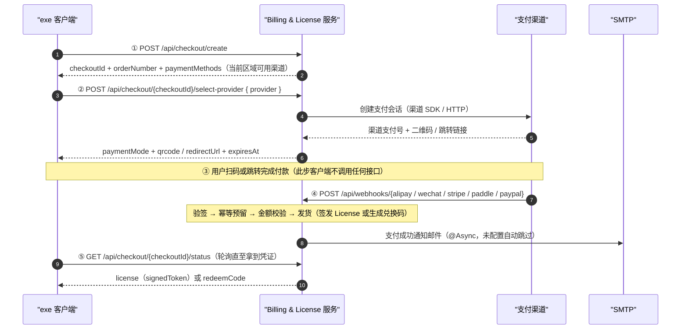

**调用次序**：`① create` → `② select-provider` → `③ 用户付款（无接口调用）` → `④ Webhook（渠道服务端发起）` → `⑤ status 取凭证`

**一步下单捷径**：`① create` 的请求体带 `provider` 时，服务端在同一事务内顺带完成第 ② 步，首次响应即含二维码 / 跳转链接 —— 次序简化为 `① → ③ → ④ → ⑤`（详见 §3.2）。

**为何 ⑤ 不可省**：第 ④ 步由渠道发起，公网回调可能丢失或验签失败；`⑤ status` 在查不到渠道已支付时会**主动向渠道对账并补发货**（详见 §3.3）。因此轮询既是取凭证，也是兜底，客户端只需稳定轮询。

#### 1.7.2 客户端兑换与校验链路

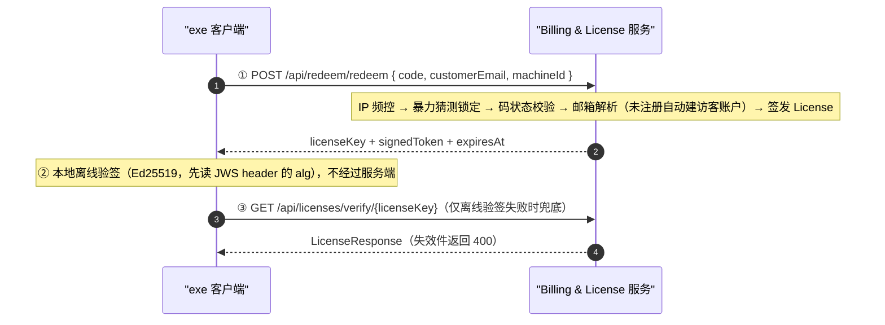

**调用次序**：`① redeem` → `② 本地离线验签` →（仅失败时）`③ verify`

#### 1.7.3 客户端账号链路（v2.10 新增）

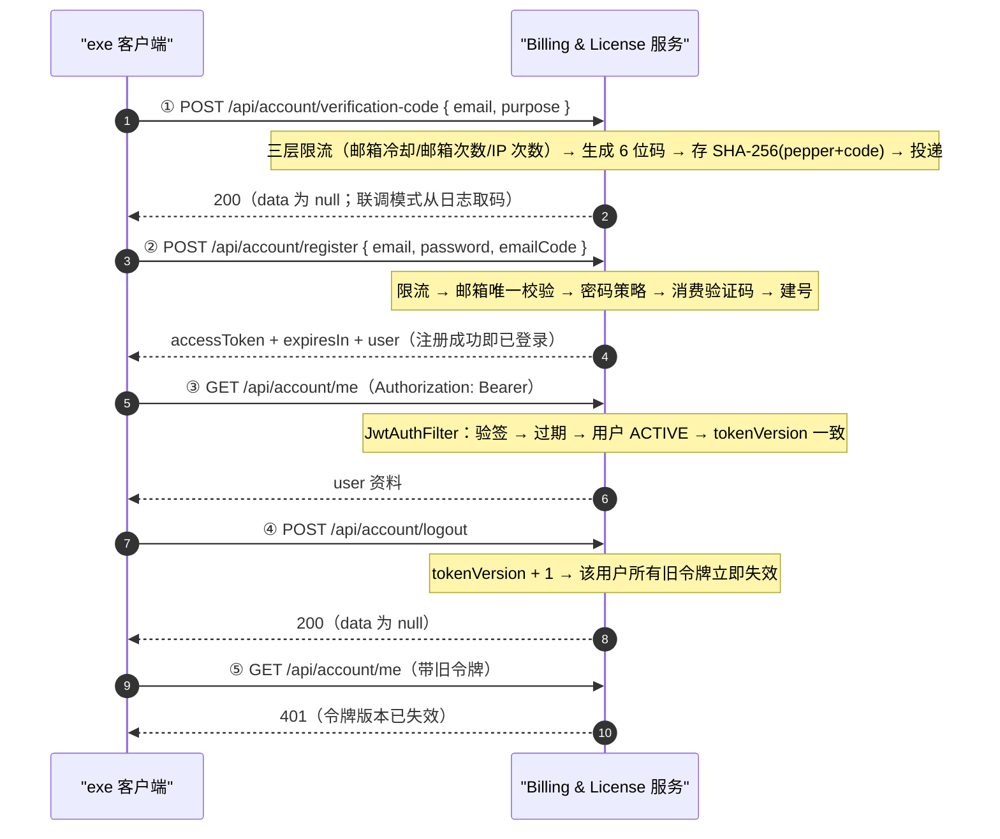

**调用次序**：`① 发码` → `② 注册` → `③ me` → `④ 登出` → `⑤ me(401)`；已注册用户直接从 `POST /api/account/login` 进入 `③`。

**三个「必须知道」的约束**：

1. **发码与校验是两次请求**：验证码不在注册响应里返回；SMTP 未配置时服务端**静默跳过发送**，须开 `ACCOUNT_CODE_LOG_ONLY=true` 联调。
2. **登录失败锁定落库**：账号级计数在 `users.failed_login_count` / `locked_until`，跨重启有效；IP 级计数在内存（多实例部署会失效，与既有限制同源）。
3. **令牌失效靠 `tokenVersion`**：登出 / 改密 / 重置密码都只是 +1，`JwtAuthFilter` 每请求比对——因此「改密后旧设备仍在线」不会发生。

#### 1.7.4 管理端运维链路（全部需请求头 `X-API-Key`）

| 场景 | 调用次序 | 关键说明 |
|---|---|---|
| 部署自检 | `GET /api/admin/payment-channels` | 先确认各渠道「配得对不对」，再跑真实交易；仅返回缺失配置项名，不回显密钥 |
| Webhook 丢失补发货 | `GET /api/admin/orders?orderNumber=` → `POST /api/admin/orders/{orderNumber}/issue` | 签发幂等，重复调用返回已签发记录（与自动发放同一服务方法） |
| 用户退款 | `GET /api/admin/orders?orderNumber=` → `POST /api/admin/orders/{orderNumber}/refund?reason=` | 渠道退款失败时落 `REFUND_FAILED`（保留 `PAID`）并抛异常，绝不谎报成功 |
| 售后换机 | `GET /api/admin/licenses?customerEmail=` → `POST /api/admin/licenses/{licenseKey}/reissue?newMachineId=` | 原证置 `REISSUED`，新证经 `reissuedFrom` 指回；受重发次数上限约束 |
| 违规作废 | `GET /api/admin/licenses/{licenseKey}` → `POST /api/admin/licenses/{licenseKey}/revoke?reason=` | 吊销唯一入口（客户端自吊销端点已删除） |
| 发卡给渠道方 | `POST /api/admin/redeem-codes/generate?productSku=&count=` → `GET /api/admin/redeem-codes?productSku=&status=` | 生成响应直接含码明文列表，便于导入发卡平台；事后可按产品/状态导出对账 |
| 兑换码作废 | `POST /api/admin/redeem-codes/revoke/{code}` | 已使用（`USED`）的码不可撤销 |

---

## 二、横切机制时序

### 2.1 请求进入链：traceId → 鉴权 → 业务 → 响应壳

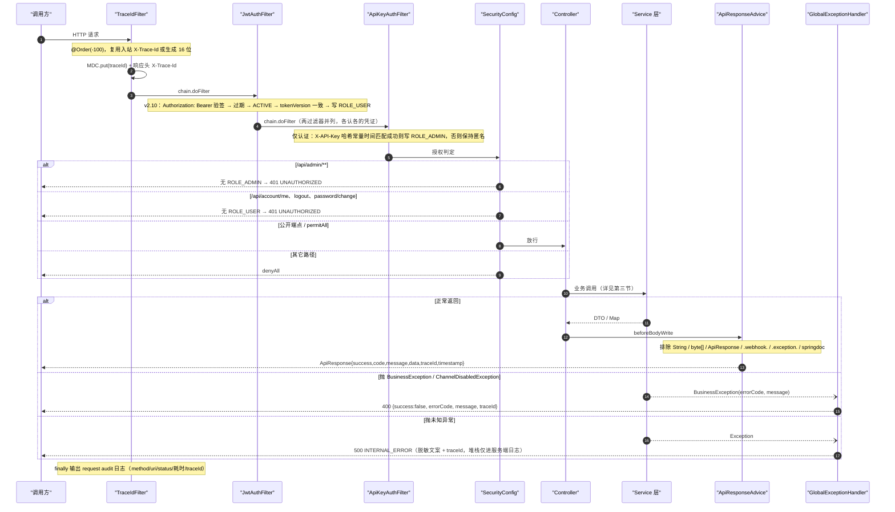

**关注点**：
- traceId 存在**两套**：`TraceIdFilter` 写入 MDC 并回写响应头（正常路径）；`GlobalExceptionHandler#newTraceId()` **另生成**一个用于异常响应体。
  二者不一致 —— 异常响应体的 `traceId` 与响应头 `X-Trace-Id` 不同源，排查时以日志中的两个值交叉比对。
- 两个过滤器（`JwtAuthFilter` / `ApiKeyAuthFilter`）都只做认证不做授权；`/api/admin/**` 与需登录账号端点的 401 由 `SecurityConfig` 的 `HttpStatusEntryPoint` 产出。
- 启动期 fail-fast：`security.admin-api-keys` 缺失则启动失败；**`account.jwt-secret` 缺失或短于 32 字节亦启动失败**（v2.10）；`payment.enabled-channels` 含无法识别渠道名则抛 `IllegalArgumentException`。

### 2.2 管理端审计切面（`@Audit` → `AuditAspect`）

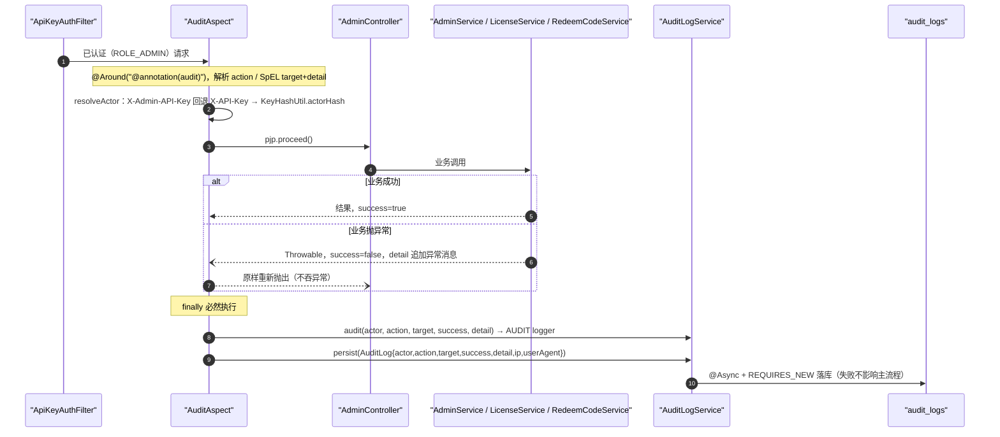

---

## 三、业务时序图

> 本章按场景给出完整调用链，图中 `autonumber` 的序号即**调用次序**；端到端顺序总览见 §1.7，各接口的入参示例见第四章。

### 3.1 收银台 · 两步下单（create → select-provider）

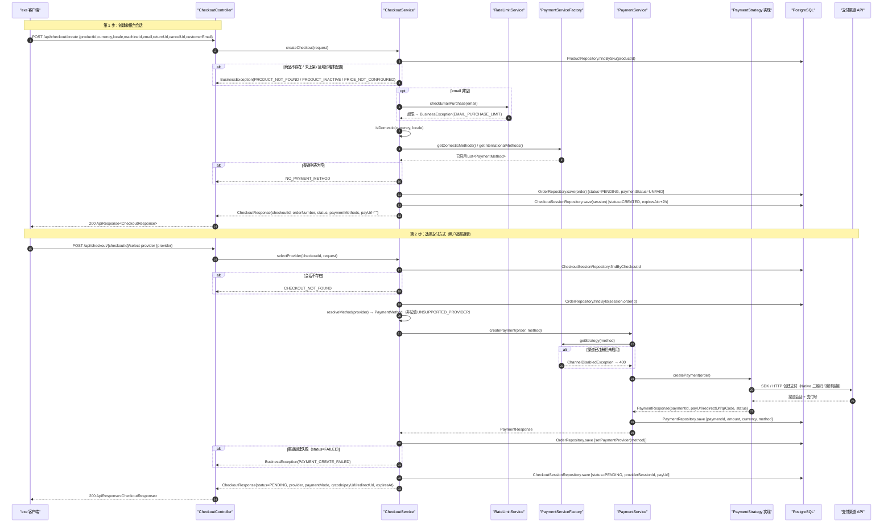

### 3.2 收银台 · 一步下单（create 携带 provider）

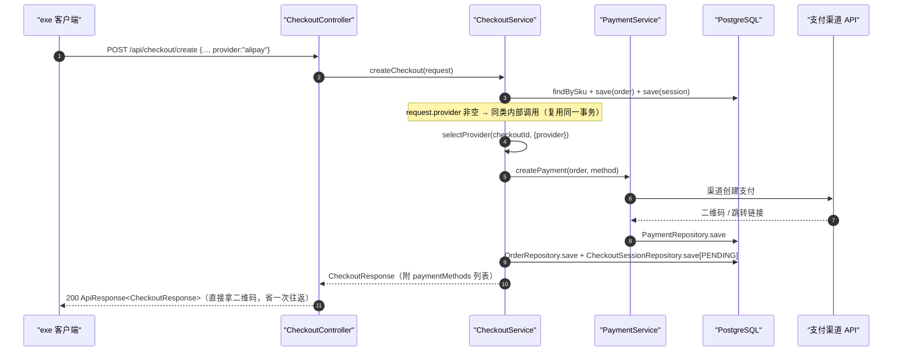

### 3.3 支付状态轮询 + 主动对账补偿（Webhook 丢失兜底）

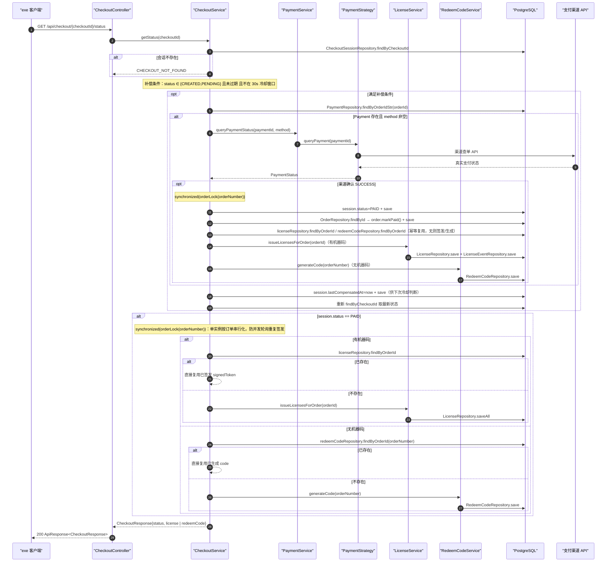

> 补偿失败（渠道超时/异常）被 `catch` 吞掉仅记 warn，不影响轮询返回，等待 Webhook 或下次轮询重试。
> 多实例部署时进程内锁不足，需补分布式锁（代码注释已声明）。

### 3.4 Webhook 支付回调 → 发货（主链路）

#### 3.4.1 渠道入口差异

| 端点 | 验签材料来源 |
|---|---|
| `POST /api/webhooks/alipay` | form-urlencoded body 中的 `sign`（`FormParamParser.parse`），**不在 Header** |
| `POST /api/webhooks/wechat` | Header `Wechatpay-Signature`（配合 Timestamp/Nonce/Serial）；成功才返回 `{"code":"SUCCESS","message":"OK"}` |
| `POST /api/webhooks/stripe` | Header `Stripe-Signature` |
| `POST /api/webhooks/paddle` | Header `Paddle-Signature` |
| `POST /api/webhooks/paypal` | Header `Paypal-Transmission-Id` |

#### 3.4.2 统一处理时序

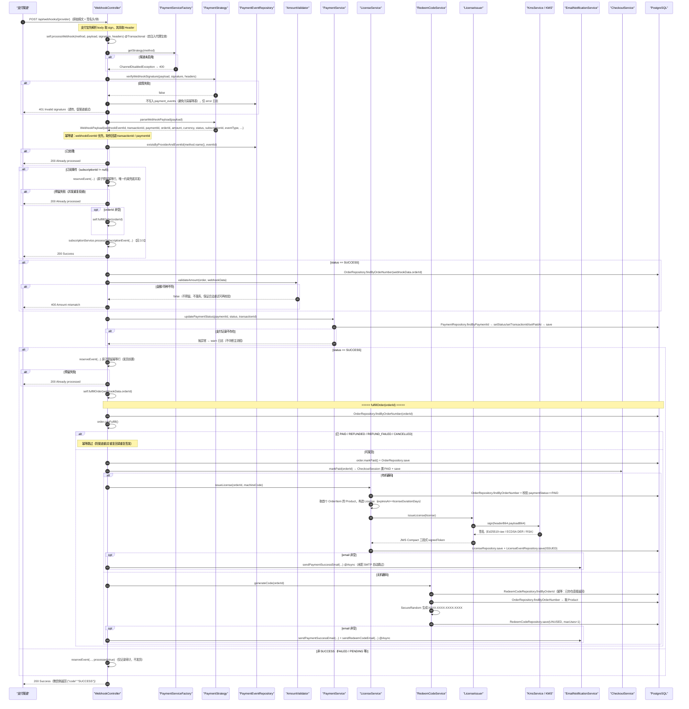

### 3.5 订阅事件处理（首充 / 续费 / 取消）

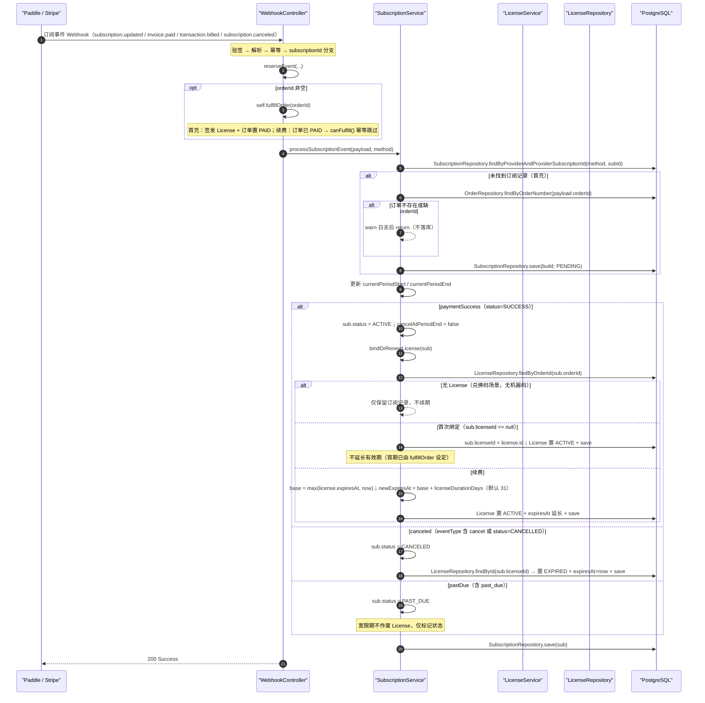

### 3.6 兑换码兑换 License


### 3.7 License 在线校验（verify）

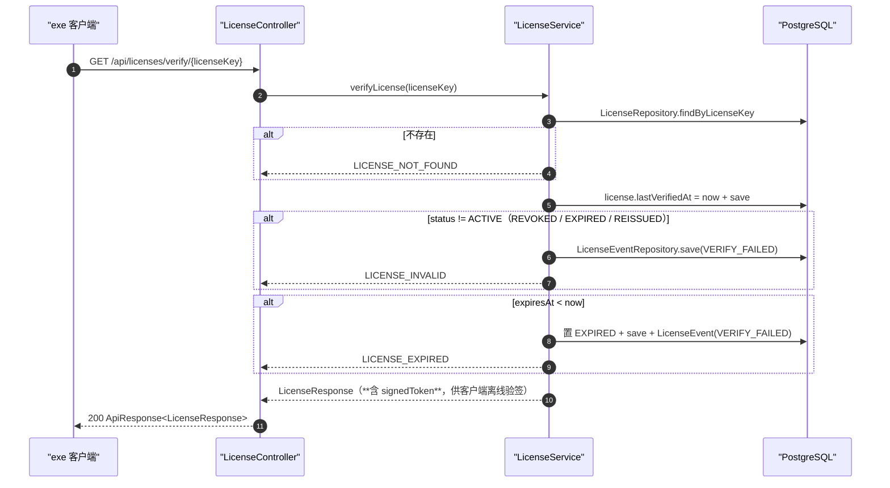

> 与 `GET /api/admin/licenses/{licenseKey}` 的区别：verify 对失效件返回 400；管理端接口**不过滤状态**且以 `adminView` 屏蔽 `signedToken`。

### 3.8 管理端 · 订单查询与补签发

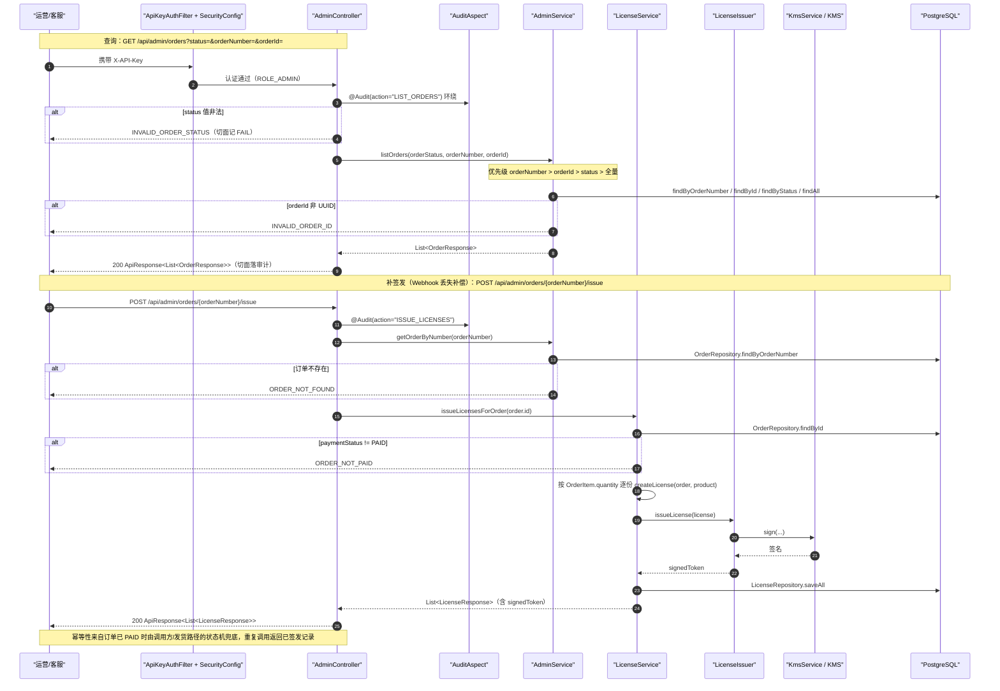

### 3.9 管理端 · 退款（渠道失败绝不谎报成功）

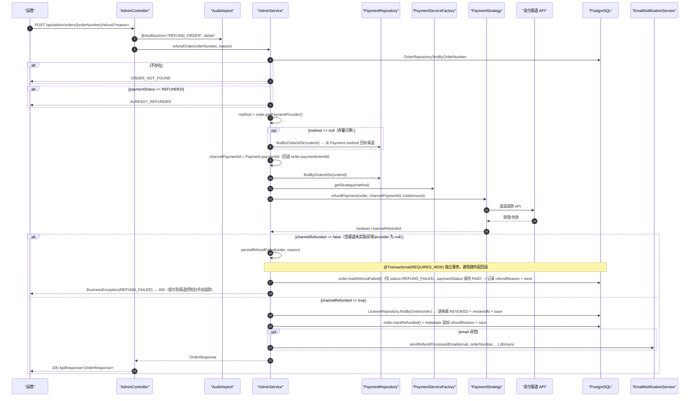

> `appendMetadata` 用 `ObjectMapper` 构造 JSON（避免手写拼接的转义/注入），脏数据以 `raw` 字段兜底，序列化失败再退化为手写拼接。

### 3.10 管理端 · License 查询 / 作废 / 换机重发

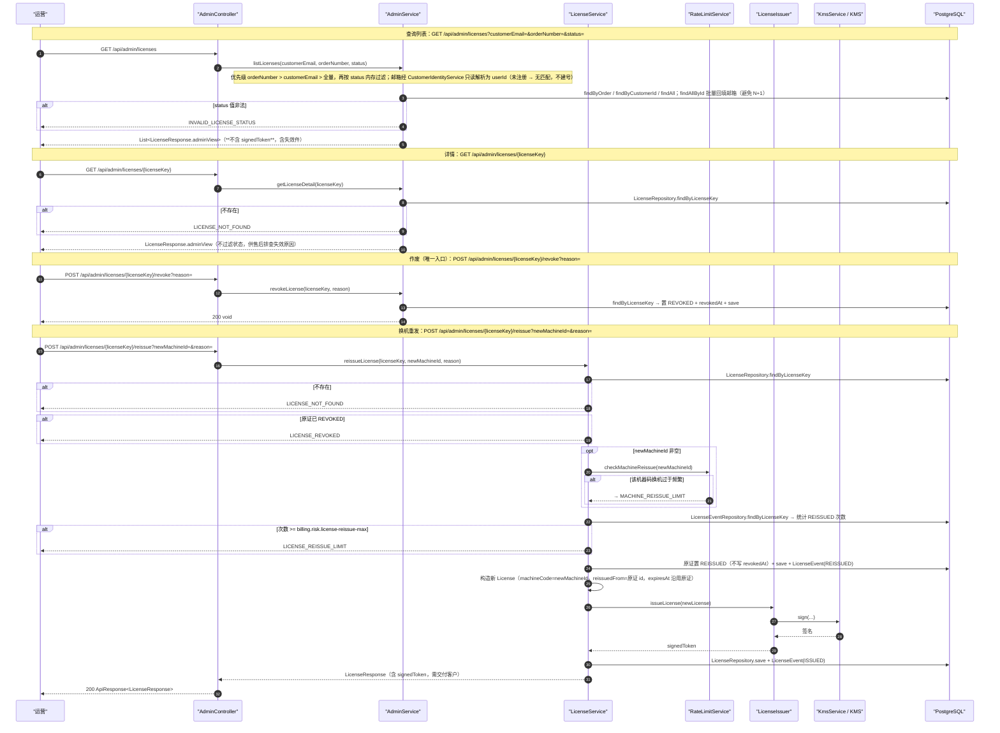

### 3.11 管理端 · 兑换码生成 / 导出 / 撤销 + 渠道自查

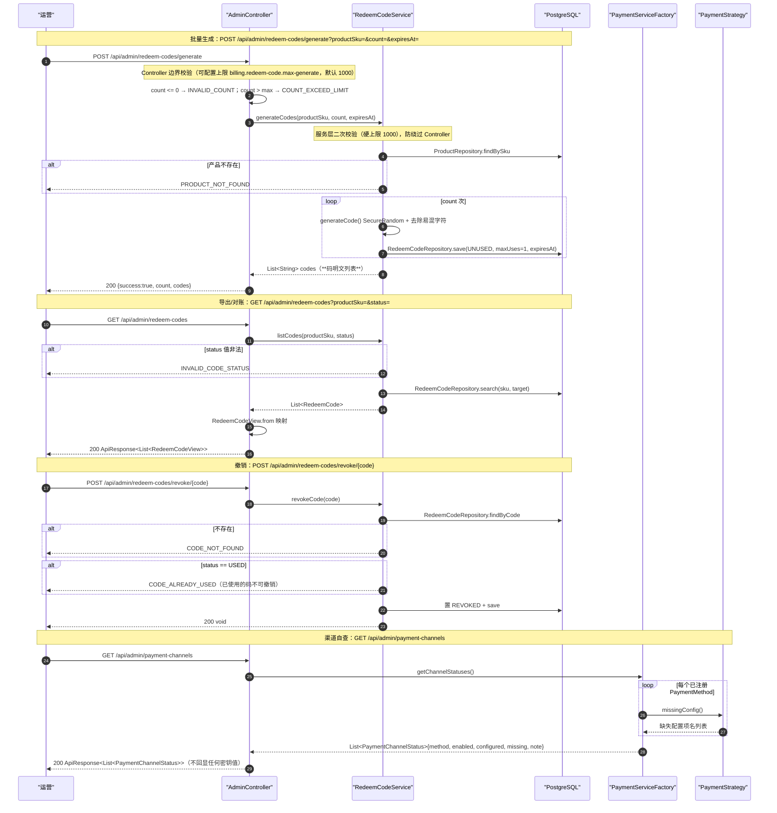

---

## 四、接口入参示例（28 个端点）

> 契约以代码为准：字段定义见 `dto/`（`@Schema` 注解）与 `controller/` 的参数声明；curl 示例与 [`README.md`](./README.md)「API 接口」段同源。
> 除 `/api/webhooks/**` 外，响应均被 `ApiResponseAdvice` 包为统一响应壳（见 `README.md`「响应结构」），故成功响应不再逐条重复；仅标注需要关注的响应要点。

### 4.1 收银台（公开）

#### ① `POST /api/checkout/create` — 创建收银台会话

请求体（`dto/CheckoutRequest`，`Content-Type: application/json`）：

| 字段 | 类型 | 必填 | 说明 |
|---|---|---|---|
| `productId` | string | ✅ | 产品 SKU；种子数据 `pro-buyout` / `pro-plus-buyout` / `pro-subscription` / `pro-plus-subscription`。不存在 / 未上架 / 区域价未配置 → `PRODUCT_NOT_FOUND` / `PRODUCT_INACTIVE` / `PRICE_NOT_CONFIGURED` |
| `currency` | string | — | `CNY` / `USD` |
| `locale` | string | — | 如 `zh-CN`；与 `currency` 共同决定区域（`currency=CNY` 或 `locale` 以 `zh` 开头 → 国内） |
| `machineId` | string | — | 传入则支付后**直接签发绑定设备的 License**；不传则生成兑换码 |
| `email` | string | — | 发货通知收件人；受邮箱购买频控（`EMAIL_PURCHASE_LIMIT`） |
| `returnUrl` / `cancelUrl` | string | — | 网页支付回跳地址 |
| `customerEmail` | string(email) | — | 对外客户标识（E2，2026-09-18 邮箱化）；不传/空 → `EMAIL_REQUIRED`；格式非法 → `INVALID_EMAIL`；未注册邮箱自动建访客账户（解析为该账户 userId） |
| `provider` | string | — | 传入即**一步下单**（见 §1.7.1）；取值 `alipay` / `wechat_pay` / `stripe` / `paddle` / `paypal`，不区分大小写 |

```bash
# 两步下单：先拿可用渠道列表（带 provider 则一步下单，响应直接含二维码/跳转链接）
curl -X POST http://localhost:8080/api/checkout/create \
  -H "Content-Type: application/json" \
  -d '{
    "productId": "pro-buyout",
    "currency": "CNY",
    "locale": "zh-CN",
    "machineId": "ABCD-1234-EFGH-5678",
    "email": "buyer@example.com",
    "customerEmail": "buyer@example.com",
    "returnUrl": "https://pay.example.com/success",
    "cancelUrl": "https://pay.example.com/cancel"
  }'
```

#### ② `POST /api/checkout/{checkoutId}/select-provider` — 选择支付方式

路径参数 `checkoutId`（string，必填）；请求体 `dto/SelectProviderRequest`：

```bash
curl -X POST "http://localhost:8080/api/checkout/cs_9f8e7d6c5b4a/select-provider" \
  -H "Content-Type: application/json" \
  -d '{"provider": "alipay"}'
```

> `provider` **必填**；非法值 → `UNSUPPORTED_PROVIDER`，渠道已注册但未启用 → `ChannelDisabledException`（400）。
> 响应 `paymentMode=qrcode` 时取 `qrcode` 渲染；`paymentMode=redirect` 时取 `redirectUrl` 跳转。

#### ③ `GET /api/checkout/{checkoutId}/status` — 轮询支付状态

```bash
curl "http://localhost:8080/api/checkout/cs_9f8e7d6c5b4a/status"
```

> 无请求体、无查询参数。渠道确认已支付后，`data` 含 `license`（signedToken）或 `redeemCode`。

### 4.2 兑换码兑换（公开）

#### ④ `POST /api/redeem/redeem`

请求体（`dto/RedeemCodeRequest`）：

| 字段 | 类型 | 必填 | 说明 |
|---|---|---|---|
| `code` | string | ✅ | 兑换码明文；无效 / 已使用 / 已过期 → 对应 `CODE_*` 错误码 |
| `customerEmail` | string(email) | — | 对外客户标识（E2，2026-09-18 邮箱化）；不传/空 → `EMAIL_REQUIRED`；格式非法 → `INVALID_EMAIL`；未注册邮箱自动建访客账户（解析为该账户 userId） |
| `machineId` | string | — | 传入则 License 绑定该设备 |

> `clientIp` **不在请求体中**：该字段由服务端按真实连接地址填充（`@JsonIgnore` + `@Schema(hidden = true)`），客户端传入无效。

```bash
curl -X POST http://localhost:8080/api/redeem/redeem \
  -H "Content-Type: application/json" \
  -d '{
    "code": "K7D2-9FQA-M3PZ-88BC",
    "customerEmail": "buyer@example.com",
    "machineId": "ABCD-1234-EFGH-5678"
  }'
```

响应 `data`（`dto/RedeemResponse`，J3 起为类型化 DTO，原为匿名 `Map`）：

| 字段 | 类型 | 说明 |
|---|---|---|
| `success` | boolean | 固定 `true`；与响应壳 `success` 同义，为兼容既有客户端保留 |
| `licenseKey` | string | License 密钥，客户端激活与在线校验用 |
| `signedToken` | string | 签名令牌（JWS Compact），供离线验签；请勿写入日志 |
| `expiresAt` | datetime / null | 过期时间（ISO-8601，无时区）；永久授权为 `null` |

### 4.3 License 在线校验（公开）

#### ⑤ `GET /api/licenses/verify/{licenseKey}`

```bash
curl http://localhost:8080/api/licenses/verify/LIC-2F8A-7C31-9D04-B5E6
```

> 路径参数 `licenseKey` 必填。有效件返回完整视图（含 `signedToken`）；过期 / 吊销 / 已换机重发 → 400。

### 4.4 支付回调（公开，由渠道服务端发起）

#### ⑥–⑩ `POST /api/webhooks/{alipay|wechat|stripe|paddle|paypal}`

入参为**各渠道原始报文**，不遵循统一请求体；签名位置随渠道而异：

| 端点 | 请求体 | 签名位置 |
|---|---|---|
| `/api/webhooks/alipay` | `application/x-www-form-urlencoded` 异步通知原文 | 表单参数 `sign` |
| `/api/webhooks/wechat` | 微信支付 v3 通知 JSON | 请求头 `Wechatpay-Signature` |
| `/api/webhooks/stripe` | Stripe 事件 JSON | 请求头 `Stripe-Signature` |
| `/api/webhooks/paddle` | Paddle 事件 JSON | 请求头 `Paddle-Signature` |
| `/api/webhooks/paypal` | PayPal 事件 JSON | 请求头 `Paypal-Transmission-Id` |

> **不可用 curl 模拟**（需渠道侧真实签名），联调方式见 `scripts/README.md` 与归档 plan `plan-v2.5-t1-channel-verify.md`。
> **响应不经统一响应壳**：成功返回渠道期望的原文（微信要求 `{"code":"SUCCESS"}`），失败透传真实状态码（验签失败 401、金额不符 400），避免渠道误判投递成功而停止重试。

### 4.5 管理端 · 订单（请求头 `X-API-Key: <admin-key>`）

#### ⑪ `GET /api/admin/orders` — 订单查询

查询参数均可选；`orderNumber` / `orderId` 优先于 `status`；全部留空返回全部订单。

| 参数 | 类型 | 说明 |
|---|---|---|
| `status` | string | `PENDING` / `CONFIRMED` / `PROCESSING` / `COMPLETED` / `CANCELLED` / `REFUNDED` / `REFUND_FAILED` / `PAID`；非法值 → `INVALID_ORDER_STATUS` |
| `orderNumber` | string | 业务订单号（精确匹配） |
| `orderId` | string(uuid) | 订单 UUID（精确匹配） |

```bash
curl "http://localhost:8080/api/admin/orders?status=PAID" -H "X-API-Key: admin-key-0001"
curl "http://localhost:8080/api/admin/orders?orderNumber=ORD-20260914-0001" -H "X-API-Key: admin-key-0001"
```

#### ⑫ `POST /api/admin/orders/{orderNumber}/issue` — 补签发 License

```bash
curl -X POST "http://localhost:8080/api/admin/orders/ORD-20260914-0001/issue" \
  -H "X-API-Key: admin-key-0001"
```

> 路径参数 `orderNumber` 必填；无请求体、无查询参数。要求订单已支付，否则 400。

#### ⑬ `POST /api/admin/orders/{orderNumber}/refund` — 退款

```bash
curl -X POST "http://localhost:8080/api/admin/orders/ORD-20260914-0001/refund?reason=用户申请" \
  -H "X-API-Key: admin-key-0001"
```

> 路径参数 `orderNumber` 必填；查询参数 `reason`（可选）。退款目标交易号取自 `Payment` 实体记录。

### 4.6 管理端 · License（请求头 `X-API-Key`）

#### ⑭ `GET /api/admin/licenses` — License 查询

| 参数 | 类型 | 说明 |
|---|---|---|
| `customerEmail` | string(email) | 客户邮箱（对外标识，E2）；只读解析为 userId，未注册 → 无匹配（不建号） |
| `orderNumber` | string | 业务订单号（优先于 `customerEmail`） |
| `status` | string | `ACTIVE` / `EXPIRED` / `REVOKED` / `REISSUED` |

```bash
curl "http://localhost:8080/api/admin/licenses?customerEmail=buyer@example.com" -H "X-API-Key: admin-key-0001"
curl "http://localhost:8080/api/admin/licenses?status=REISSUED" -H "X-API-Key: admin-key-0001"
```

> 返回**脱敏视图**（不含 `signedToken`），且含失效件；`customerEmail` 由 `customerId` 批量回填（`findAllById`，避免 N+1）。

#### ⑮ `GET /api/admin/licenses/{licenseKey}` — License 详情

```bash
curl "http://localhost:8080/api/admin/licenses/LIC-2F8A-7C31-9D04-B5E6" -H "X-API-Key: admin-key-0001"
```

> 与公开 `verify` 的区别：本端点**不过滤状态**，可查失效件及其原因。

#### ⑯ `POST /api/admin/licenses/{licenseKey}/revoke` — 作废 License

```bash
curl -X POST "http://localhost:8080/api/admin/licenses/LIC-2F8A-7C31-9D04-B5E6/revoke?reason=违规使用" \
  -H "X-API-Key: admin-key-0001"
```

> 路径参数 `licenseKey` 必填；查询参数 `reason`（可选）。成功返回 200 且**响应体为空**（`ApiResponseAdvice` 对 null 体不包壳）。

#### ⑰ `POST /api/admin/licenses/{licenseKey}/reissue` — 换机重发

```bash
curl -X POST "http://localhost:8080/api/admin/licenses/LIC-2F8A-7C31-9D04-B5E6/reissue?newMachineId=NEW-MACHINE-0001&reason=changed_pc" \
  -H "X-API-Key: admin-key-0001"
```

> `newMachineId` **必填**（声明为必填查询参数，缺失即 400）；`reason` 可选。受单 License 重发次数上限约束（`LICENSE_REISSUE_LIMIT`）。

### 4.7 管理端 · 兑换码与运维（请求头 `X-API-Key`）

#### ⑱ `POST /api/admin/redeem-codes/generate` — 批量生成兑换码

| 参数 | 类型 | 必填 | 说明 |
|---|---|---|---|
| `productSku` | string | ✅ | 产品 SKU |
| `count` | int | ✅ | 正整数；`≤ 0` → `INVALID_COUNT`，超上限（默认 1000，配置项 `billing.redeem-code.max-generate`）→ `COUNT_EXCEED_LIMIT` |
| `expiresAt` | datetime | — | ISO-8601 |

```bash
curl -X POST "http://localhost:8080/api/admin/redeem-codes/generate?productSku=pro-buyout&count=100" \
  -H "X-API-Key: admin-key-0001"
# → data: {"success":true,"count":100,"codes":["K7D2-9FQA-M3PZ-88BC", ...]}
```

响应 `data`（`dto/GenerateRedeemCodesResponse`，J3 起为类型化 DTO，原为匿名 `Map`）：

| 字段 | 类型 | 说明 |
|---|---|---|
| `success` | boolean | 固定 `true`；与响应壳 `success` 同义，为兼容既有客户端保留 |
| `count` | int | 实际生成的兑换码数量 |
| `codes` | string[] | 兑换码明文列表（顺序即生成顺序）；**明文仅此一次返回**，事后对账用 ⑲ |

#### ⑲ `GET /api/admin/redeem-codes` — 导出 / 对账

```bash
curl "http://localhost:8080/api/admin/redeem-codes?productSku=pro-buyout&status=UNUSED" \
  -H "X-API-Key: admin-key-0001"
```

> `productSku` 与 `status`（`UNUSED` / `USED` / `EXPIRED` / `REVOKED`）均可选；非法状态 → `INVALID_CODE_STATUS`。

#### ⑳ `POST /api/admin/redeem-codes/revoke/{code}` — 撤销兑换码

```bash
curl -X POST "http://localhost:8080/api/admin/redeem-codes/revoke/K7D2-9FQA-M3PZ-88BC" \
  -H "X-API-Key: admin-key-0001"
```

> 路径参数 `code` 必填；已使用（`USED`）的码不可撤销。

#### ㉑ `GET /api/admin/payment-channels` — 支付渠道配置自查

```bash
curl "http://localhost:8080/api/admin/payment-channels" -H "X-API-Key: admin-key-0001"
```

> 无参数。返回各渠道 `{method, enabled, configured, missingConfig, note}`，仅暴露缺失配置项名，不回显任何密钥值。

### 4.8 账号（v2.10 新增，7 个端点）

> A4 登出 / A5 me / A6 改密 需请求头 `Authorization: Bearer <accessToken>`；其余 4 个为公开端点。

#### ㉒ `POST /api/account/verification-code` — 发送邮箱验证码

| 字段 | 类型 | 必填 | 说明 |
|---|---|---|---|
| `email` | string | ✅ | 邮箱格式；服务端统一转小写 |
| `purpose` | string | ✅ | `REGISTER` / `RESET_PASSWORD` |

```bash
curl -X POST http://localhost:8080/api/account/verification-code \
  -H "Content-Type: application/json" \
  -d '{"email":"user@example.com","purpose":"REGISTER"}'
# → data 为 null；联调模式（ACCOUNT_CODE_LOG_ONLY=true）验证码写日志：
#   [code-log-only] 验证码已生成：email=..., purpose=REGISTER, code=483920
```

> 签发新码会作废同邮箱同用途的旧未消费码，任何时刻最多一个有效码。触发限流 → `CODE_SEND_TOO_FREQUENT`。

#### ㉓ `POST /api/account/register` — 注册

| 字段 | 类型 | 必填 | 说明 |
|---|---|---|---|
| `email` | string | ✅ | 未被注册 |
| `password` | string | ✅ | 8–72 位，含字母与数字（`account.password-*` 可配） |
| `emailCode` | string | ✅ | `purpose=REGISTER` 的验证码；一次性消费 |

```bash
curl -X POST http://localhost:8080/api/account/register \
  -H "Content-Type: application/json" \
  -d '{"email":"user@example.com","password":"Passw0rd2026","emailCode":"483920"}'
# → data: {"accessToken":"eyJhbGciOi...","expiresIn":604800,"user":{...}}
```

> `data.user` 与 ㉖ `me` 同结构（`dto/UserProfileResponse`）。注册成功即已登录，无需再调 login。

#### ㉔ `POST /api/account/login` — 登录

```bash
curl -X POST http://localhost:8080/api/account/login \
  -H "Content-Type: application/json" \
  -d '{"email":"user@example.com","password":"Passw0rd2026"}'
```

> 邮箱不存在与密码错误**都返回 `INVALID_CREDENTIALS`**（不区分，防账号枚举）。同一账号连续失败 5 次 → `ACCOUNT_LOCKED` 锁定 15 分钟（落库）。

#### ㉕ `POST /api/account/logout` — 登出（需登录）

```bash
curl -X POST http://localhost:8080/api/account/logout \
  -H "Authorization: Bearer <accessToken>"
```

> `tokenVersion` +1 → 该用户**所有**已签发令牌立即失效（不限当前这一台）。`data` 为 null。

#### ㉖ `GET /api/account/me` — 当前用户（需登录）

```bash
curl http://localhost:8080/api/account/me -H "Authorization: Bearer <accessToken>"
# → data: {"id":"8b2c4d6e-...","email":"user@example.com","emailVerified":true,
#          "status":"ACTIVE","createdAt":"2026-09-15T01:30:00","lastLoginAt":"2026-09-15T09:12:44"}
```

> 无请求参数。`data.id` 即 `Order.customerId`（决策 1）。

#### ㉗ `POST /api/account/password/change` — 改密（需登录）

| 字段 | 类型 | 必填 | 说明 |
|---|---|---|---|
| `oldPassword` | string | ✅ | 不匹配 → `OLD_PASSWORD_MISMATCH` |
| `newPassword` | string | ✅ | 不得与旧密码相同；须满足密码策略 |

```bash
curl -X POST http://localhost:8080/api/account/password/change \
  -H "Authorization: Bearer <accessToken>" -H "Content-Type: application/json" \
  -d '{"oldPassword":"Passw0rd2026","newPassword":"NewPassw0rd2026"}'
```

> 成功后 `tokenVersion` +1，**需重新登录**。

#### ㉘ `POST /api/account/password/reset` — 找回密码（公开）

| 字段 | 类型 | 必填 | 说明 |
|---|---|---|---|
| `email` | string | ✅ | 注册邮箱 |
| `code` | string | ✅ | `purpose=RESET_PASSWORD` 的验证码 |
| `newPassword` | string | ✅ | 须满足密码策略 |

```bash
curl -X POST http://localhost:8080/api/account/password/reset \
  -H "Content-Type: application/json" \
  -d '{"email":"user@example.com","code":"483920","newPassword":"NewPassw0rd2026"}'
```

> 邮箱未注册时同样落到 `CODE_INVALID`（不暴露账号是否存在）。成功后该用户所有令牌失效。

---

## 五、附录

### 5.1 外部系统依赖一览

| 外部系统 | 调用点 | 失败影响 |
|---|---|---|
| 支付宝 SDK | `AlipayStrategy#createPayment` / `queryPayment` / `refundPayment` | 下单 `PAYMENT_CREATE_FAILED`；退款 `REFUND_FAILED` |
| 微信支付 API v3 | `WechatPayStrategy`（GET 查单 / 退款 / 回调验签解密） | 同上 |
| Stripe SDK | `StripeStrategy`（`Session.create` / `Session.retrieve` / `Refund` / `Webhook.constructEvent`） | 同上 |
| Paddle API | `PaddleStrategy`（Checkout 会话 / 事件验签 / 订阅事件） | 同上 |
| PayPal API | `PayPalStrategy`（Orders v2 / OAuth token / 验签 / Refund） | 同上 |
| KMS | `LicenseIssuer#issueLicense` → `KmsService#sign`（local 文件 / 阿里云） | 签发失败抛 `RuntimeException`，发货中断（事务回滚） |
| SMTP | `EmailNotificationService`（`@Async`） | 未配置自动跳过；发送异常仅记日志，不阻塞主流程 |
| PostgreSQL | 全部 Repository | 见各 `@Transactional` 边界 |

### 5.2 类 → 方法调用速查

```
CheckoutController#create            → CheckoutService#createCheckout
CheckoutController#selectProvider    → CheckoutService#selectProvider → PaymentService#createPayment
CheckoutController#status            → CheckoutService#getStatus → compensateFromChannel / fulfillSession
RedeemCodeController#redeemCode      → RedeemCodeService#redeemCode → doRedeem → LicenseIssuer#issueLicense
LicenseController#verifyLicense      → LicenseService#verifyLicense
WebhookController#*Webhook           → WebhookController#processWebhook → strategy(verify/parse)
                                       → PaymentService#updatePaymentStatus
                                       → WebhookController#fulfillOrder → LicenseService#issueLicense
                                                                        → RedeemCodeService#generateCode
                                                                        → CheckoutService#markPaid
                                       → SubscriptionService#processSubscriptionEvent
AdminController#listOrders           → AdminService#listOrders → OrderService#mapToResponse
AdminController#issueLicenses        → AdminService#getOrderByNumber + LicenseService#issueLicensesForOrder
AdminController#refundOrder          → AdminService#refundOrder → strategy#refundPayment
                                        （失败）AdminService#persistRefundFailed（REQUIRES_NEW）
AdminController#listLicenses         → AdminService#listLicenses
AdminController#getLicense           → AdminService#getLicenseDetail
AdminController#revokeLicense        → AdminService#revokeLicense
AdminController#reissueLicense       → LicenseService#reissueLicense
AdminController#generateRedeemCodes  → RedeemCodeService#generateCodes
AdminController#listRedeemCodes      → RedeemCodeService#listCodes
AdminController#revokeRedeemCode     → RedeemCodeService#revokeCode
AdminController#paymentChannels      → PaymentServiceFactory#getChannelStatuses → strategy#missingConfig
```

### 5.3 已识别的实现细节/不一致（供后续跟进）

1. **traceId 双源**：`TraceIdFilter`（MDC + 响应头）与 `GlobalExceptionHandler#newTraceId()`（异常响应体）各自生成，值不一致，异常场景无法用响应体的 traceId 直接检索到请求审计日志。
2. **进程内锁的部署边界**：`CheckoutService#fulfillmentLocks`、`RateLimitService#windows` 均为单实例内存态；多实例部署需要分布式锁与共享限流存储（代码注释已声明为已知限制）。
3. **`AdminService#resolveMethod` 为无用私有方法**：`refundOrder` 内未调用它（渠道解析走 `order.getPaymentProvider()` + `Payment.method` 回补），属可清理的死代码。
4. **`PaymentService#updatePaymentStatus` 在支付记录缺失时抛 `RuntimeException`**，会随 `processWebhook` 的 `@Transactional` 回滚整个 Webhook 处理（含已预留的幂等行），渠道重试时行为需关注。
